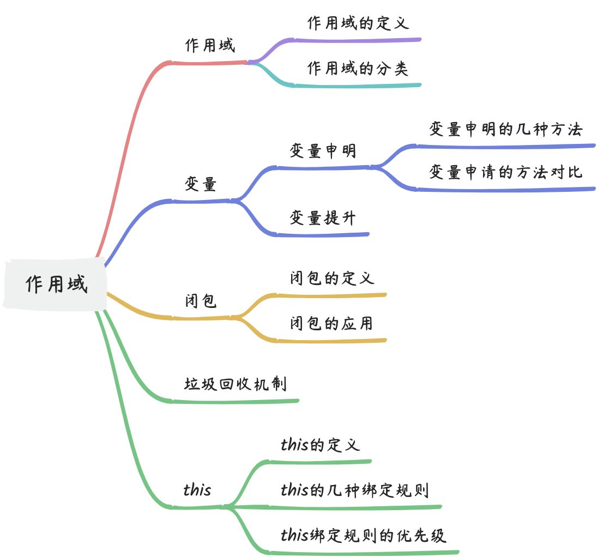

# 作用域




### 作用域
#### 定义
作用域是指在程序中定义变量的可见范围。


#### 分类
1. 全局作用域

指在程序中定义在最外层的变量，它在整个程序的任何位置都可以被访问到。


2. 函数作用域

指在函数中定义的变量，它们只能在该函数内部被访问到，函数外部无法访问。在函数中定义的变量也可以被嵌套在其他函数的作用域中，这样就形成了作用域链。

当程序执行到一个作用域时，它会先搜索该作用域中的变量，如果找到了就直接使用，否则就向上一级作用域继续搜索，直到找到全局作用域为止。这个搜索过程形成了作用域链，它保证了变量在正确的作用域中被访问和使用。


3. 块级作用域
    1. with
    2. try/catch
    3. let
    4. const


#### 扩展点
+ JavaScript 中的作用域还有一个特殊的地方，就是在函数中定义的变量，如果没有使用关键字 `var` 或 `let` 等声明，它就会变成全局变量。这种情况下，该变量会被添加到全局对象中，可以在任何作用域中访问和使用。
+ IIFE的作用：
    - 不会污染外部作用域
    - 当作函数调用并传递参数进去(window, undefined)  


### 变量
#### 申明变量
##### 申明变量的方法
1. var
2. let
3. const


##### 申明变量的方法对比
+ `const`声明时，声明和赋值必须同时进行，否则会报错；
+ `var`可重复声明同一个变量、`let`无法重复声明同一个变量；
+ `var`声明的变量会在预解析阶段进行变量提升、`let`无变量提升；
+ `var`声明的变量不会识别块级作用域、`let`声明的变量会识别块级作用域；
+ `var`声明的全局变量会变成window的属性、`let`声明的变量不会；


#### 变量提升
##### 变量提升原理
引擎会在解释 JavaScript 代码之前首先对其进行编译。编译阶段中的一部分工作就是找到所有的声明，并用合适的作用域将它们关联起来。

包括变量和函数在内的所有声明都会在任何代码被执行前首先被处理。

另外值得注意的是，每个作用域都会进行提升操作。


##### 变量提升规则
1. `var`申明的变量和函数声明都会在当前作用域进行变量提升。
2. 函数声明的提升优先级高于`var`。
3. 函数表达式却不会被提升。


#### 扩展
+ 暂时性死区

只要在块级作用域内存在`let`/`const`命令，它所声明的变量就会绑定这个区域，不再受外部的影响。在声明变量时，提前使用变量会报错。


### 闭包
#### 定义
闭包是指有权访问另一个函数作用域中变量的函数，优点是私有化数据，在私有化数据的基础上保持数据，缺点使用不恰当会导致内存泄漏，在不需要用到的时候及时把变量置为`null`。


#### 详细来说
闭包可以将变量和函数私有化，从而避免命名冲突和变量污染。当函数执行完毕后，该函数内部定义的变量和函数仍然存在于内存中，不会被自动回收，因此可以被其他函数继续访问和使用。这个机制称为闭包。  
	闭包的原理是在内存中创建一个包含函数和变量的环境，当函数返回后，该环境仍然存在于内存中，因此可以被其他函数访问和使用。闭包中的变量和函数可以被多次调用和修改，因此可以实现许多高级功能。  


#### 应用
闭包的应用非常广泛，特别是在异步编程和模块化开发中。以下是一些常见的使用场景：

1. 保存变量状态和私有化变量和函数。
2. 用于事件处理和回调函数。
3. 用于封装类和模块。
4. 用于实现柯里化和函数式编程。
5. 用于解决循环中异步问题。
6. 用于实现缓存和记忆化等功能。


#### 注意事项
需要注意的是，闭包会占用内存并且容易造成内存泄漏，因此在使用闭包时需要注意内存管理和性能优化等问题。  


#### 扩展
##### 闭包一定会造成内存
不是所有闭包都会造成内存泄漏，只有在不正确使用闭包的情况下才会发生内存泄漏。  
	当一个函数返回一个内部函数，而该内部函数持有外部函数的变量时，就会形成闭包。如果该内部函数在外部函数执行结束后仍然存在，那么它会一直持有外部函数的变量，导致这些变量无法被垃圾回收器回收，从而造成内存泄漏。  
	例如，以下代码就存在内存泄漏的风险：

```javascript
function outer() {
  var count = 0;
  return function inner() {
    count++;
    console.log(count);
  }
}

var f = outer();
f(); // 1f(); // 2
```


在这个例子中，`outer()` 函数返回一个内部函数 `inner()`，而 `inner()` 持有了 `outer()` 函数的变量 `count`。如果 `inner()` 函数一直存在，`count` 变量就无法被释放，从而导致内存泄漏。  
	为了避免内存泄漏，我们可以手动解除闭包，即将对内部函数的引用删除。例如，可以将内部函数赋值为 `null`，或者将外部函数返回的引用赋值为 null。  
	总之，闭包不一定会造成内存泄漏，只有在不正确使用闭包的情况下才会发生内存泄漏。在编写代码时，需要注意正确使用闭包并避免内存泄漏的问题。<font style="color:rgb(226, 226, 226);background-color:rgb(20, 20, 20);">  
</font>

##### 使用哪些方式可以防止闭包引起的内存泄露
1. 避免创建不必要的闭包：如果闭包中包含的变量在函数执行完后不再需要使用，可以避免创建闭包，从而避免内存泄漏的问题。
2. 及时释放闭包：在使用闭包时，需要在不需要时及时释放闭包，可以使用变量赋值为 null 或者手动解除对闭包的引用等方式来释放闭包。
3. 使用模块模式：在模块模式中，可以使用立即执行函数（IIFE）来创建一个私有作用域，从而避免闭包中的变量被外部访问，避免了内存泄漏的问题。
4. 避免循环引用：如果闭包中引用了 DOM 元素或其他对象，需要确保在不需要时及时释放这些对象，避免循环引用造成内存泄漏的问题。


### 垃圾回收机制


### this
#### 定义
this 是在运行时进行绑定的，并不是在编写时绑定，它的上下文取决于函数调用时的各种条件。this 的绑定和函数声明的位置没有任何关系，只取决于函数的调用方式。  
	当一个函数被调用时，会创建一个活动记录（有时候也称为执行上下文）。这个记录会包含函数在哪里被调用（调用栈）、函数的调用方法、传入的参数等信息。this 就是记录的其中一个属性，会在函数执行的过程中用到。


#### 绑定规则
##### 默认绑定
独立函数调用。可以把这条规则看作是无法应用其他规则时的默认规则。

此时`this` 指向全局对象。如果使用严格模式（strict mode），那么全局对象将无法使用默认绑定，因此 `this` 会绑定到 `undefined`。


##### 隐式绑定
调用位置是否有上下文对象。当函数引用有上下文对象时，隐式绑定规则会把函数调用中的 `this` 绑定到这个上下文对象。

**对象属性引用链中只有最顶层或者说最后一层会影响调用位置。**

```javascript
function foo() {
  console.log( this.a );
}

var obj2 = {
  a: 42,
  foo: foo
};

var obj1 = {
  a: 2,
  obj2: obj2
};

obj1.obj2.foo(); // 42
```


##### 显示绑定
函数的 `call(..)` 和 `apply(..)` 方法，它们的第一个参数是一个对象，它们会把这个对象绑定到 `this`，接着在调用函数时指定这个 `this`。

`bind(..)` 会返回一个硬编码的新函数，它会把参数设置为 `this` 的上下文并调用原始函数。


##### new 绑定
使用 new 来调用函数，或者说发生构造函数调用时，会自动执行下面的操作。

1. 创建一个全新的对象
2. 这个新对象的原型对象执行构造函数的原型对象。
3. **<font style="color:#DF2A3F;">这个新对象会绑定到函数调用的</font>**`**<font style="color:#DF2A3F;">this</font>**`**<font style="color:#DF2A3F;">。</font>**
4. 如果构造函数未返回其他对象，那么 `new` 表达式中的函数调用会自动返回这个新对象。


#### 绑定规则优先级
现在我们可以根据优先级来判断函数在某个调用位置应用的是哪条规则。可以按照下面的顺序来进行判断：  


1. 函数是否在 `new` 中调用（new 绑定），如果是的话 this 绑定的是新创建的对象。 

`var bar = new foo()`

2. 函数是否通过 `call`、`apply`（显式绑定）或者 `bind`，如果是的话，`this` 绑定的是 指定的对象。 

`var bar = foo.call(obj2)`

3. 函数是否在某个上下文对象中调用（隐式绑定），如果是的话，`this` 绑定的是那个上 下文对象。

`var bar = obj1.foo()`

4. 如果都不是的话，使用默认绑定。如果在严格模式下，就绑定到 `undefined`，否则绑定到 全局对象。 

`var bar = foo()`  


#### 扩展
##### 被忽略的this
如果你把 `null` 或者 `undefined` 作为 `this` 的绑定对象传入 `call`、`apply` 或者 `bind`，这些值在调用时会被忽略，实际应用的是默认绑定规则。


##### 箭头函数
箭头函数不使用 `this` 的四种标准规则，而是根据外层（函数或者全局）作用域来决定 `this`。
