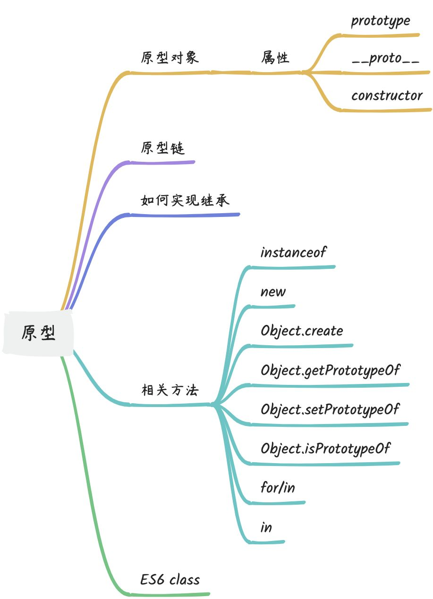
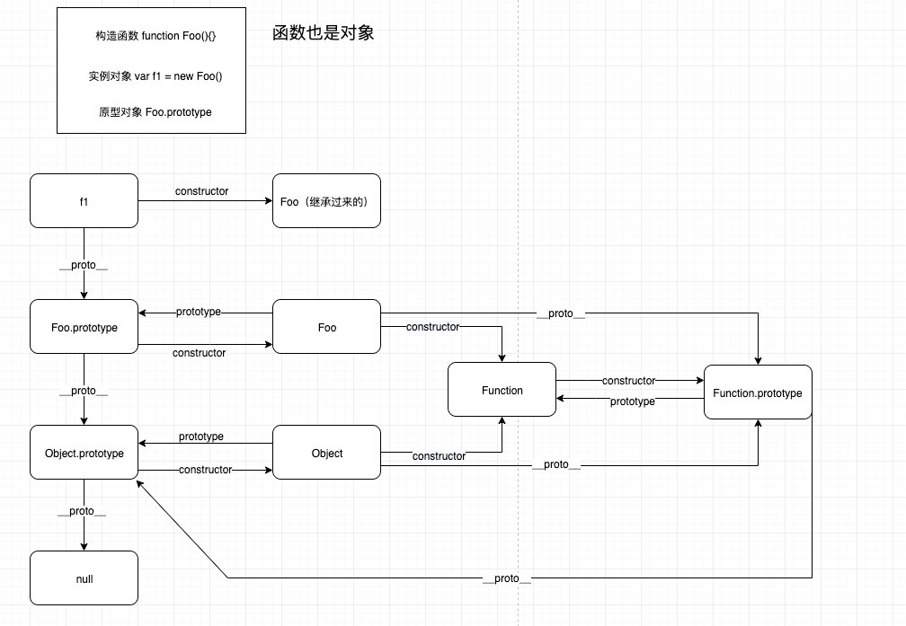

### 相关知识点



### 解释下什么是原型链
#### 原型链的概念
原型链是JavsScript中实现**<font style="color:#DF2A3F;">继承</font>**的一种方式。每个实例对象(object)都有一个私有属性(称之为`__proto__`)指向它的构造函数(`constructor`)的原型对象(`prototype`)。该原型对象也有一个自己的原型对象(__proto__)，层层向上直到一个对象的原型对象为`null`。这样就形成了一个原型链。


#### 扩展
如果在当前对象中查找某个属性或方法时，当前对象不存在该属性或方法，JavaScript 引擎会沿着原型链向上查找，直到找到该属性或方法为止，或者查找到原型链的顶端。

原型链的作用在于实现了 JavaScipt 中的继承。当一个对象需要继承另一个对象的属性和方法时。可以将父对象设为子对象的原型对象，从而使子对象能够沿着原型链访问父对象的属性和方法。


#### 缺点
在原型链上查找属性比较耗时，对性能有副作用。这在性能要求苛刻(一般情况基本无影响)的情况下很重要。**另外，试图访问不存在的属性时会遍历整个原型链**。


#### 其他知识点
+ 原型链的应用：
    - 实现继承
    - 将原型作为默认值

`Function.prototype` 是一个空函数，`RegExp.prototype` 是一个“空”的正则表达式（无任何匹配），而 `Array.prototype` 是一个空数组。对未赋值的变量来说，它们是很好的默认值。

```javascript
function isThisCool(vals, fn, rx) {
  vals = vals || Array.prototype;
  fn = fn || Function.prototype;
  rx = rx || RegExp.prototype;

  return rx.test(
    vals.map(fn).join("")
  )
}

isThisCool(); // true

isThisCool(
  ["a", "b", "c"],
  function(v) { return v.toUpperCase(); },
  /D/
); // false
```

	这种方法的一个好处是 `.prototypes` 已被创建并且仅创建一次。相反，如果将 `[]`、`function(){}` 和 `/(?:)/` 作为默认值，则每次调用 `isThisCool(..)` 时它们都会被创建一次（具体创建与否取决于 JavaScript 引擎，稍后它们可能会被垃圾回收），这样无疑会造成内存和 CPU 资源的浪费。

另外需要注意的一点是，如果默认值随后会被更改，那就不要使用 `Array.prototype`。上例中的 vals 是作为只读变量来使用，更改 vals 实际上就是更改 `Array.prototype`，而这样会导致前面提到过的一系列问题！


+ `prototype`、`__proto__`、`constructor`的区别
+ 有哪些可以访问原型链的方法
    - `.`、`[]`属性访问操作符

原型链的定义。

    - `for/in`

使用`for-in`遍历对象时原理和查找`[[Prototype]]`链类似，任何可以通过原型链访问到的属性都会被枚举。

    - `in`

`in`操作符来检查属性在对象中是否存在，同样会查找对象的完整原型链(无论属性是否可枚举)。


### 如何实现继承
#### 实现继承的几种方法(掌握具体的代码实现、优缺点对比)
+ 借助构造函数
    - 思路：在子类构造函数中，调用父类的构造函数，通过`call`和`apply`改变父类构造函数中this指向子类实例
    - 缺点：无法复用父组件的方法
    - 代码：

```javascript
function Parent() {
  this.property1 = 'value1';
}

function Child() {
  Parent.call(this);
  this.property2 = 'value2';
}

var childInstance = new Child();
```


+ 原型继承
    - 思路：将子类的原型设置为父类的实例，子类实例可以使用父类原型的公有方法
    - 缺点：无法获取父组件的私有属性，且父类创建实例时，会默认调用一个父类的构造函数，浪费性能
    - 代码：

```javascript
function Parent() {
  this.property1 = 'value1';
}

function Child() {
  this.property2 = 'value2';
}

Child.prototype = Object.create(Parent.prototype);

Child.prototype.constructor = Child;

var childInstance = new Child();
```


+ 组合继承
    - 思路：将原型链与借助构造函数的技术进行组合，实现子类继承父类的私有属性和公有方法的效果
    - 缺点：父类创建实例时，会默认调用一个父类的构造函数，浪费性能
    - 代码：

```javascript
function Parent() {
  this.property1 = 'value1';
}

function Child() {
  Parent.call(this);
  this.property2 = 'value2';
}

Child.prototype = Object.create(Parent.prototype);

Child.prototype.constructor = Child;

var childInstance = new Child();
```


+ 原型式继承
    - 思路：通过复制一个对象的原型来创建一个新对象，实现继承
    - 缺点：原型式继承非常适合不需要单独创建构造函数，但仍然需要在对象间共享信息的场合。但要记住，属性中包含的引用值始终会在相关对象间共享，跟使用原型模式是一样的。
    - 代码：

```javascript
var parent = {
  property1: 'value1',
};

var child = Object.create(parent);
child.property2 = 'value2';
```


+ 寄生继承
    - 思路：将一个父类的原型赋值给一个空函数的原型，通过将子类的原型设置为空函数的实例，继承父类原型的公有方法
    - 缺点：无法获取父类的私有方法
    - 代码：

```javascript
function Parent() {
  this.property1 = 'value1';
}

function Child() {
  this.property2 = 'value2';
}

Child.prototype = Object.create(Parent.prototype);

Child.prototype.constructor = Child;

var childInstance = new Child();
```


+ 寄生组合继承
    - 思路：将寄生继承和借用构造函数方法组合，实现子类继承父类的私有属性和公有方法
    - 优点：最优方案
    - 代码：

```javascript
function Parent() {
  this.property1 = 'value1';
}

function Child() {
  Parent.call(this);
  this.property2 = 'value2';
}

Child.prototype = Object.create(Parent.prototype);

Child.prototype.constructor = Child;

var childInstance = new Child();
```


+ ES6继承
    - 思路：使用`extends`继承父类原型的共有方法，使用`super`关键字继承父类的私有属性
    - 缺点：ES6不同浏览器的兼容问题
    - 代码：

```javascript
class Parent {
  constructor() {
    this.property1 = 'value1';
  }
}

class Child extends Parent {
  constructor() {
    super();
    this.property2 = 'value2';
  }
}

var childInstance = new Child();
```


#### 其他知识点
+ 原型继承方案及优缺点对比
    - `Children.prototye === Parent.protype`

`Children.prototye === Parent.protyp`并不会创造一个关联`Children.prototype`的新对象，它只是让`Children.prototype`直接引用`Parent.prototype`对象。因此当你执行类似`Children.prototype.property1 = ...`的赋值语句时会直接修改`Parent.prototype`对象本身。这显然不是原型继承需要的效果。


    - `Children.prototype = new Parent()`

`Children.prototype = new Parent()`的确会创建一个关联到`Children.prototype`的新对象。但是它使用了`Parent()的“构造函数调用”`，如果构造函数`Parent`有一些副作用(比如写日志、修改状态、注册到其他对象、给this添加数据属性等)的话，就会影响到`Children()`的“实例后代”，会造成副作用。


    - `Children.prototye = Object.create(Parent.prototype)`

`Object.create()`不使用具有副作用的`Parent()`。这样做的唯一缺点就是需要创建一个新对象然后把旧对象抛弃掉，不能直接修改已有的默认对象。会带来的轻微性能损失(抛弃的对象需要进行垃圾回收)


    - `Object.setPrototypeOf(Children.prototype, Parent.Prototype)`

不使用具有副作用的`Parent()`，也不会创建新对象。但是可读性没有`Object.create()`高。


+ ES6 class


### 介绍下`prototype`、`__proto__`、`constructor`的区别
#### 概念
+ `prototype`：构造函数的属性，指向其原型对象
+ `__proto__`：对象的属性，指向其构造函数的原型对象。非JS标准属性，由浏览器实现。
+ `constructor`：原型对象的属性(不可枚举)，指向其构造函数


#### 三者的区别



#### 其他知识点
+ 构造函数 => 实例对象 如何实现?

使用`new`操作符

+ `instanceof`


### new 
#### 讲概念
`new`具体做了哪些事

`new` 操作符用于创建一个新的对象，并将该对象绑定到构造函数(`constructor`)的`this`上。具体来说，`new`操作符的执行过程可以分为以下几个步骤：

1. 创建一个空白对象，该对象的原型为构造函数的原型对象。
2. 将构造函数的`this`绑定到该空对象上。
3. 执行构造函数的代码，并将属性和方法添加到该空对象中。
4. 如果构造函数没有显式返回一个对象，则返回该空对象；否则，返回构造函数显示返回的对象。


#### 手写
```javascript
function myNew(constructor, ...args) {
	// 创建一个空对象,该对象的原型为构造函数的原型对象
  var obj = Object.create(Constructor.prototype);
  // 讲构造函数的 this 绑定到该空对象上, 执行构造函数的代码
  var result = Constructor.apply(obj, args);
  // 如果构造函数有显示返回一个对象, 则返回该对象, 否则返回空对象
  return (typeof result === 'object' && result !== null) ? result : obj;
}
```


#### 其他知识点
+ 还有哪些可以建立或修改原型关系的方法吗
    - `Ojbect.create`
    - `Object.setPrototypeOf`
    - ...
+ 构造函数可以通过`new`调用也可以直接当做函数调用，如何判断构造函数式通过`new`调用的?

函数可以通过检查 `new.target` 来知道它是否是通过 `new` 被调用的。当函数在没有使用 `new` 的情况下被调用时，`new.target` 的值为 `undefined`。


### instanceof
#### 概念
1. `instanceof`用于检测构造函数的`prototype`属性是否出现在某个实例对象的原型链上
2. **面试官如果追问：**详细来说：`instanceof`的原理是通过检测`object`的原型链是否包含`constrcutor`的原型对象。如果`object`的原型链中存在`constrcutor`的原型对象，那么`object`就是`constructor`的一个实例，返回值为true。如果object的原型链中不存在`constructor`的原型对象，那么object就不是`constructor`的实例，返回值为false。


#### 手写
```javascript
function myInstanceOf(obj, constructor) {
  // 获取 obj 的原型
	let proto = Object.getPrototypeOf(obj);

  while (proto) {
    if (proto === constructot.prototype) {
      return true;
    }
    // 获取原型链上的下一个原型
    proto = Object.getPrototypeOf(proto);
  }

  return false;
}
```


#### 扩展
需要注意的是，`instanceof`只能用于检测对象是否是某个构造函数的实例，不能用于基本类型(字符串、数字等)的检查。如果检查的对象不是一个对象类型，`instanceof`会输出false。

此外`instanceof`是基于原型链的检查，因此如果某个对象的原型链比较深，那么检查的效率会比较低。

`instanceof`判断的是对象的原型链，因此如果一个对象是某个类的实例，那么它一定是该类的原型链上的某个对象的实例。因此，如果一个对象的原型链上没有该类的原型对象，那么它就不是该类的实例，即使它与该类具有相同的属性和方法。**<font style="color:#DF2A3F;">(需要考虑用户手动修改对象的原型链场景)</font>**


#### 其他知识点
+ 还有哪些可以检测原型链的方法
    - `isPrototyOf`：判断对象是否在指定对象的原型链上（指定该对象带`prototype`）
    - `in`：查看指定对象是否在某对象的原型链上


### Object.create
#### 概念
创建一个新对象，使用现有的对象来提供新创建的对象的原型。


#### 手写
```javascript
Object.myCreate = function (proto) {
  function F () {};
  F.prototype = proto;
  return new F();
}
```


### class
#### 概念
ES6引入的类的语法糖


#### 扩展
+ class无变量提升
+ `extends`：继承父类
+ `super`：调用父类构造函数，就像它是一个函数名一样
    - 如果使用`extends`关键字定义了一个类，那么这个类的构造函数必须使用`super()`调用父类构造函数。
    - 在通过`super()`调用父类构造函数之前，不能在构造函数中使用`this`关键字。这条强制规则是为了确保父类先于子类得到初始化。
    - 在没有使用`new`关键字调用的函数中，特殊表达式`new.target`的值是undefined。而在构造函数中，`new.target`引用的是被调用的构造函数。当子类构造函数被调用并使用`super()`调用父类构造函数时，该父类构造函数通过`new.target`可以获取子类构造函数。设计良好的父类无须知道自己是否有子类，但它们可以使用`new.target.name`来记录日志消息。


### 其他问题
#### 属性foo不存在与实例对象，而存在于原型对象上时，对实例对象进行操作myObj.foo = 'bar'，会发生什么情况?
分三种情况

+ 如果在 `[[Prototype]]` 链上层存在名为 `foo` 的普通数据访问属性并且没有被标记为只读（`writable:false`），那就会直接在 `myObject` 中添加一个名为 `foo` 的新属性，它是屏蔽属性。
+ 如果在 `[[Prototype]] `链上层存在 foo，但是它被标记为只读（`writable:false`），那么无法修改已有属性或者在 `myObject` 上创建屏蔽属性。如果运行在严格模式下，代码会抛出一个错误。否则，这条赋值语句会被忽略。总之，不会发生屏蔽。
+ 如果在 `[[Prototype]]` 链上层存在 `foo` 并且它是一个 `setter`，那就一定会调用这个 `setter`。`foo` 不会被添加到（或者说屏蔽于）`myObject`，也不会重新定义 `foo` 这个 `setter`。


### 参考资料
+ 体系化答题面试题-基础八股：[https://www.yuque.com/u1598738/vqazlv/khym6ehyhxht1gng#B2u3D](https://www.yuque.com/u1598738/vqazlv/khym6ehyhxht1gng#B2u3D)
+ JS权威指南
+ 你不知道的JavsScript上

