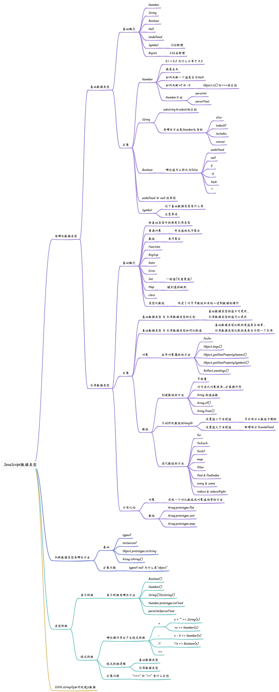

### 相关知识点梳理



### 基础数据类型-Number
#### 0.1 + 0.2 为什么不等于 0.3
##### 核心
在 JavaScript 中，浮点数是以 `IEEE 754` 标准的二进制浮点数表示的，它采用二进制的形式来表示实数。而二进制无法精确地表示某些十进制小数，例如 0.1 和 0.2，因为它们在二进制下是无限循环的小数，而浮点数只有 64 位的精度。  
	因此，当在 JavaScript 中执行 0.1 + 0.2 的计算时，由于无法精确表示这两个数字，它们会被转换成最接近的可表示二进制数，然后再进行计算。这会导致一个微小的舍入误差，使得结果不等于 0.3。


##### 如何解决
可以使用`toFixed()`方法奖结果四舍五入到指定小数位数，例如：

```javascript
const sum = 0.1 + 0.2; // 0.30000000000000004
const roundedSum = sum.toFixed(1); // "0.3" console.log(roundedSum === "0.3"); // true
```

	

需要注意的是，`toFixed()`方法返回一个字符串类型的结果，因此需要注意类型转换。


#### 什么是精度丢失问题？
JavaScript 数字格式允许你精确地表示`−2<sup>53</sup> + 1`和`2<sup>53</sup> - 1`间 的所有整数。如果使用大于这个值的整数值，则可能会丢失末尾数字的精度。


#### 如何判断一个值是否为NaN
1. `Number.isNaN(val)`
2. `val !== val`：利用`NaN`不等于本身的特性
3. `Object.is(val, NaN)`
4. `isNaN()`：<u><font style="color:#DF2A3F;">这个方法不能判断一个值是否为NaN，</font></u>`<u><font style="color:#DF2A3F;">isNaN()</font></u>`<u><font style="color:#DF2A3F;">函数内部会强制类型转换为数字，再进行判断。</font></u>


#### 介绍下 Object.is() 与 === 的区别
`Object.is()` 和 `===` 之间的唯一区别在于它们处理带符号的 `0` 和 `NaN` 值的时候。

+ `Object.is()`将`+0`和`-0`视为不相等，`NaN`彼此间视为相等。
+ `===`将`+0`和`-0`视为相等，`NaN`彼此间视为不相等。
+ 能使用 `==` 和` ===` 时就尽量不要使用 `Object.is()`，因为前者效率更高、更为通用。`Object.is()`主要用来处理那些特殊的相等比较。


#### ["1", "2", "3"].map(parseInt)
期望输出 `[1, 2, 3]`, 而实际结果是 `[1, NaN, NaN]`。

原因：`parseInt`接收两个参数，第一个参数是要转换的字符串，第二个参数是基数（即进制）。所以`["1", "2", "3"].map(parseInt)`相当与`["1", "2", "3"].map(parseInt(item,index))`。

1. 对于第一个元素 "1"，`parseInt("1", 0)` 被调用，其中 0 是默认的进制。因此，"1" 将被解析为十进制数 1。
2. 对于第二个元素 "2"，`parseInt("2", 1)` 被调用，其中 1 是一个无效的进制，因为进制应该在 2 到 36 之间。因此，"2" 无法解析为有效的整数，返回 `NaN`。
3. 对于第三个元素 "3"，`parseInt("3", 2)` 被调用，其中 2 是二进制进制。但是，"3" 不是有效的二进制数字，因此返回 `NaN`。

最终，map 方法返回的新数组是 `[1, NaN, NaN]`。


若要求输出 `[1, 2, 3]`，可实现的方法：

```javascript
["1", "2", "3"].map(item => parseInt(item, 10));
```


####  特殊数字计算
```javascript
0 / 0; // NaN
Infinity/Infinity; // NaN
```


### 基础数据类型-String
#### substring 和 substr 的区别
`substring()` 和 `substr()` 都是 JavaScript 字符串的方法，用于截取字符串的一部分。它们的区别在于参数的不同。  
	`substring()` 方法接收两个参数，起始位置和结束位置。它截取从起始位置到结束位置之间的字符，包括起始位置的字符，但不包括结束位置的字符。如果省略第二个参数，则截取到字符串末尾。  
	`substr()` 方法接收两个参数，起始位置和截取的字符数。它从起始位置开始截取指定数量的字符，如果省略第二个参数，则截取到字符串末尾。


### 基础数据类型-Boolean
#### 哪些值可以转化为false
+ undefined
+ null
+ 0
+ -0
+ NaN
+ ""


### 基础数据类型-Undefined & Null
#### typeof null 为什么是 object
##### 核心
`typeof null` 的结果为 "object"，这是 JavaScript 语言的一个历史遗留问题。  
	在 JavaScript 最初的版本中，使用 32 位的值表示一个变量，其中前 3 位用于表示值的类型。000 表示对象，010 表示浮点数，100 表示字符串，110 表示布尔值，和其他的值都被认为是指针。  
	在这种表示法下，null 被解释为一个全零的指针，也就是说它被认为是一个空对象引用，因此 `typeof null` 的结果就是 "object"。


##### 扩展
虽然这个设计是一个历史遗留问题，但是由于历史原因，已经成为 JavaScript 语言的一部分，无法修复。因此在判断变量是否为 null 时，建议使用严格相等运算符（`===`）进行判断。


#### undefined 和 null 的异同
1. `null` 表示 `无` 的对象，也就是此处不应该有值；而 `undefined` 表示未定义。
2. 在转换数字的时候，`Number(null)` 为 `0`，而 `Number(undefined)` 为 `NaN`。
3. `null` 和 `undefined` 都没有任何属性或方法。事实上，使用`.`或 `[]` 访问这些值的属性或方法会导致 `TypeError`。
4. 两者都是假值：当需要布尔值时，它们的行为类似于假值。
5. `null` 是一个特殊关键字，不是标识符，我们不能将其当作变量来使用和赋值。然而`undefined` 却是一个标识符，可以被当作变量来使用和赋值(**<font style="color:#DF2A3F;">严格模式下会报错</font>**)。


#### 针对undefined的安全防范机制
举个简单的例子，在程序中使用全局变量 DEBUG 作为“调试模式”的开关。在输出调试信息到控制台之前，我们会检查 DEBUG 变量是否已被声明。顶层的全局变量声明 `var DEBUG = true` 只在 `debug.js` 文件中才有，而该文件只在开发和测试时才被加载到浏览器，在生产环境中不予加载。  
	问题是如何在程序中检查全局变量 DEBUG 才不会出现 `ReferenceError` 错误。这时 `typeof` 的安全防范机制就成了我们的好帮手：

```javascript
// 这样会抛出错误
if (DEBUG) {
  console.log("Debugging is starting");
}

// 这样是安全的
if (typeof DEBUG !== "undefined") {
  console.log("Debugging is starting");
}
```

  


### 基础数据类型-Symbol
#### Symbol这个新增的基础数据类型有什么用
##### 讲概念
Symbol 是在 ES6 中新增的基础数据类型，它的主要作用是创建一个唯一的标识符，用于对象属性名的命名、常量的定义等场景。


##### 作用：
1. 每个 Symbol 都是唯一的，可以用作对象的属性名，这样就可以避免属性名冲突的问题。。
2. `Symbol`属性，不会被一般的遍历方法获取到，可以模拟私有。有专门获取Symbol属性的方法：
    1. `Object.getOwnPropertySymbols()`：返回`Symbol`类型的属性键组成的数组。
    2. `Reflect.ownKeys()`：返回目标对象自身的属性键组成的数组，等同于`Object.getOwnPropertyNames(target).concat(Object.getOwnPropertySymbols(target))`
3. `[Symbol.Iterator]`：可以给不可迭代的数据类型提供迭代接口。


##### 相关方法
1. Symbol()

这个函数不会两次返回相同的值，即使调用时带有相同的实参。


2. toString()

`Symbol()`调用时带有相同的实参，也不会返回相同的值。这时候可以用`toString()`判断传入的值是否相同。

```javascript
const s1 = Symbol('a');
const s2 = Symbol('a');

console.log(s1 === s2); // false
console.log(s1.toString()); // 'Symbol(a)'
console.log(s1.toString() === s2.toString()); // true
```


3. Symbol.for()

`JavaScript` 定义了一个全局 `Symbol` 注册表。`Symbol.for()`函数接受一个字符串实参，并返回与所传递的字符串相关联的 `Symbol` 值。如果没有与该字符串相关联的符号，则创建并返回一个新的符号；否则，返回已经存在的符号。

`Symbol.for()`函数与 `Symbol()` 函数完全不同：`Symbol()` 不会两次返回相同的值，但 `Symbol.for()` 在使用相同的字符串调用时总是返回相同的值。传递给 `Symbol.for()` 的字符串出现在返回符号的 `toString() `的输出中，也可以通过调用返回符号的 `Symbol.keyfor()` 来检索它。

```javascript
let s = Symbol.for("shared");
let t = Symbol.for("shared");
s === t          // => true
s.toString()     // => "Symbol(shared)"
Symbol.keyFor(t) // => "shared"
```


### 引用数据类型-Object
#### 如何合并对象
+ `Object.assign`
+ 扩展运算符`...`

需要注意的是，如果合并的对象中有同名属性，则后面的属性值会覆盖前面的属性值。


#### 所有枚举属性的方法
1. for/in

获取指定对象的每个**<font style="color:#DF2A3F;">可枚举属性(自有或继承)</font>**。

2. Object.keys()

返回对象**<font style="color:#DF2A3F;">可枚举自有属性</font>**名的数组。不包含不可枚举属性、继承属性或属性名是Symbol的属性。

3. Object.getOwnPropertyNames()

与`Object.keys()`类似，但**<font style="color:#DF2A3F;">也会返回不可枚举自有属性名</font>**的数组，只要它们的属性名是String。

4. Object.getOwnPropertySymbols()

返回属性名是Symbol的**<font style="color:#DF2A3F;">自有属性</font>**，**<font style="color:#DF2A3F;">无论是否可枚举</font>**。

5. Reflect.ownKeys()

返回所有属性名，包括可枚举和不可枚举属性，以及字符串属性和符号属性。


#### 如何判断一个对象是不是空对象
+ `Object.keys`：使用`Object.keys()获取对象的属性列表，然后判断列表长度是否为0`。
+ `for...in` + `Object.prototype.hasOwnProperty`：循环遍历对象，如果有属性存在则不是空对象。
+ JSON.stringify：`JSON.stringify(obj) === "{}"`。


#### 基本包装类型
##### 概念
`Number`、`String`、`Boolean`三种基本数据类型为基本包装类型。直接用字面量创建时，调用方法，如：`'222'.split()`

1. 首先会新建包装对象：`new String()`
2. 使用包装对象调用`split`方法
3. 将调用结果赋值给目标变量
4. 最后再删除包装对象


##### 注意点
使用封装对象时有些地方需要特别注意。

比如 Boolean：

```javascript
var a = new Boolean(false);

if (!a) {
  console.log("Oops"); // 执行不到这里
}
```

	我们为 `false` 创建了一个封装对象，然而该对象是真值（“truthy”，即总是返回 `true`），所以这里使用封装对象得到的结果和使用 `false` 截然相反。


一般不推荐直接使用封装对象。


##### 拆封
如果想要得到封装对象中的基本类型值，可以使用 `valueOf()` 函数：

```javascript
var a = new String("abc");
var b = new Number(42);
var c = new Boolean(true);

a.valueOf(); // "abc"
b.valueOf(); // 42
c.valueOf(); // true
```


#### 对象循环引用会导致什么问题
1. 当垃圾回收机制使用引用计数法时，无法回收变量循环引用的内存，会造成内存泄漏
2. 循环引用的对象，使用`JSON.stringify()`会报错


### 引用数据类型-Array
#### splice 和 slice 会改变原数组吗？怎么删除数组最后一个元素
`splice`和`slice`都是数组的方法，两者作用不同。

1. `splice`方法可以在数组中添加、删除或替换元素，并返回被删除的元素，它会改变原数组。
2. `slice`方法是从原数组中返回指定开始和结束位置的元素组成的新数组，不会改变原数组。


删除数组中的最后一个元素，有几种方法

```javascript
const arr = [1, 2, 3, 4];

// 1.使用pop
const lastElement = arr.pop(); // 返回被删除的元素:4

// 2.使用splice
const lastElement = arr.splice(-1, 1); // 返回被删除的元素:4

// 3.使用slice和展开运算符创建一个新数组,包含除最后一个元素外的所有元素
const lastElement = [...arr.slice(0, -1)];
```

	

需要注意的是，以上方法都会改变或创建一个新的数组，原数组不会被保留最后一个元素。如果要仅仅取得最后一个元素，可以使用下标或者`slice`。


#### 数组遍历迭代方法


### JavaScript 中如何判断数据类型
#### typeof
`typeof` 操作符可以返回一个值的数据类型，它适用于除了 `null` 以外的所有值。

+ "undefined"：表示值未定义。
+ "boolean"：表示值为布尔值。
+ "number"：表示值为数值。
+ "string"：表示值为字符串。
+ "symbol"：表示值为符号。
+ "object"：表示值为对象或 null。
+ "function"：表示值为函数。  


需要注意的是，`typeof null` 返回 "object"，这是一个历史遗留问题。

####  instanceof
`instanceof` 操作符可以判断一个对象是否是某个构造函数的实例。


#### Object.prototype.toString
##### 概念
`Object.prototype.toString` 方法可以返回一个值的内部类型，它适用于所有值，包括 `null` 和 `undefined`。

语法：`Object.prototype.toString.call(value)`

其中，value 表示要判断类型的值。返回值是一个形如 [object Type] 的字符串，其中 Type 表示值的内部类型。例如：

```javascript
Object.prototype.toString.call(undefined); // "[object Undefined]"
Object.prototype.toString.call(null); // "[object Null]"
Object.prototype.toString.call(true); // "[object Boolean]"
Object.prototype.toString.call(123); // "[object Number]"
Object.prototype.toString.call("abc"); // "[object String]"
Object.prototype.toString.call(Symbol("foo")); // "[object Symbol]"
Object.prototype.toString.call({}); // "[object Object]"
Object.prototype.toString.call(function () {}); // "[object Function]"
Object.prototype.toString.call([]); // "[object Array]"
Object.prototype.toString.call(new Date()); // "[object Date]"
Object.prototype.toString.call(/abc/); // "[object RegExp]"
```


##### 原理
所有 `typeof` 返回值为 "object" 的对象（如数组）都包含一个内部属性`[[Class]]`（我们可以把它看作一个内部的分类，而非传统的面向对象意义上的类）。这个属性无法直接访问，一般通过 `Object.prototype.toString()` 来查看。

虽然 `Null()` 和 `Undefined()` 这样的原生构造函数并不存在，但是内部 `[[Class]]` 属性值仍然是 "Null" 和 "Undefined"。

其他基本类型值（如`String`、`Number`和`Boolean`）的情况有所不同，通常称为“包装”。这几个基本类型值被各自的封装对象自动包装，所以它们的内部 `[[Class]]` 属性值分别为"String"、"Number" 和 "Boolean"。


##### 扩展
需要注意的是，使用 `Object.prototype.toString` 方法判断包装对象时，返回的是其对应基本数据的类型，而非包装对象本身的类型。  
	除了上述方法之外，还有一些其他的判断类型的方式，如 `Array.isArray` 判断数组类型、`isNaN` 判断是否为 NaN、`Number.isInteger` 判断是否为整数等。不同的判断方式适用于不同的场景，具体选择哪一种方式应根据实际情况而定。  


### 类型转换
#### == 和 === 有什么区别
在 JavaScript 中，`==` 和 `===` 都用于比较两个值是否相等，但它们的比较方式不同。  
	`==` 运算符进行比较时，会先进行类型转换，然后再比较两个值是否相等。类型转换的规则比较复杂，但可以简单地概括为以下几点：

1. 如果两个值类型相同，则直接比较它们的值。
2. 如果一个值是 `null`，另一个值是 `undefined`，则它们相等。
3. 如果一个值是数字，另一个值是字符串，则将字符串转换为数字后再比较。
4. 如果一个值是布尔值，另一个值是非布尔值，则将布尔值转换为数字后再比较。
5. 如果一个值是对象，另一个值是数字、字符串或布尔值，则将对象转换为原始值后再比较。

`===` 运算符进行比较时，不进行类型转换，只有当两个值的类型和值都相等时才会返回 true。

一般来说建议优先使用 `===` 运算符进行比较，因为它可以避免类型转换的问题，更加严格和安全。


### 
