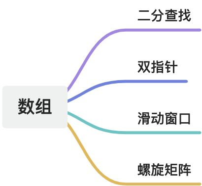

# 数组




### 二分查找
#### 适用场景
+ 数组为有序数组
+ 数组中无重复元素


#### 注意点
##### 边界条件处理
+ 定义 `target` 是在一个在左闭右闭的区间里，也就是`[left, right]`时，循环判断条件需要使用`<=`，因为`left == right`是有意义的，如：`while (left <= right)`。
+ `if (nums[middle] > target)` `right` 要赋值为 `middle - 1`，因为当前这个`nums[middle]`一定不是`target`，那么接下来要查找的左区间结束下标位置就是 `middle - 1`。


#### 经典题目
##### 题目
[leetcode 704 二分查找](https://leetcode.cn/problems/binary-search/description/)

[leetcode 1146 快照数组](https://leetcode.cn/problems/snapshot-array/description/) **<font style="color:#DF2A3F;">(使用上面的二分无效，需要使用其他二分法)</font>**


##### 代码
```javascript
/**
 * @param {number[]} nums
 * @param {number} target
 * @return {number}
 */
var search = function(nums, target) {
    let start = 0, end = nums.length - 1;
    while (start <= end) {
        const middle = Math.floor((start + end) / 2);
        if (nums[middle] < target) {
            start = middle + 1;
        } else if (nums[middle] > target) {
            end = middle - 1;
        }  else {
            return middle
        }
    }

    return -1;
};
```


### 双指针(快慢指针)
#### 定义
通过一个快指针和慢指针在一个for循环下完成两个for循环的工作。


定义快慢指针

+ 快指针：寻找新数组的元素 ，新数组就是不含有目标元素的数组
+ 慢指针：指向更新 新数组下标的位置


双指针法（快慢指针法）在数组和链表的操作中是非常常见的，很多考察数组、链表、字符串等操作的面试题，都使用双指针法。


#### 适用场景
+ 针对性能有要求的数组及链表操作。
+ 要求不能新建数组、在原数组上操作。


#### 经典题目
##### 题目
[leetcode 27 移除元素](https://leetcode.cn/problems/remove-element/)


##### 代码
```javascript
/**
 * @param {number[]} nums
 * @param {number} val
 * @return {number}
 */
var removeElement = function(nums, val) {
    const len = nums.length;
    let slow = 0, fast = 0;

    while (fast < len) {
        if (nums[fast] !== val) {
            nums[slow] = nums[fast];
            fast++;
            slow++;
        } else {
            fast++;
        }
    }

    return slow;
};
```


### 滑动窗口
#### 定义
所谓滑动窗口，就是不断的调节子序列的起始位置和终止位置，从而得出我们要想的结果。滑动窗口也可以理解为双指针法的一种！只不过这种解法更像是一个窗口的移动，所以叫做滑动窗口更适合一些。

可以发现滑动窗口的精妙之处在于根据当前子序列和大小的情况，不断调节子序列的起始位置。从而将`O(n^2)`暴力解法降为`O(n)`。

####   
适用场景
+ 要求针对连续的子数组
+ 对性能有要求


#### 注意点
##### 性能
不要以为`while`里放一个`while`就以为是`O(n^2)`啊， 主要是看每一个元素被操作的次数，每个元素在滑动窗后进来操作一次，出去操作一次，每个元素都是被操作两次，所以时间复杂度是 `2 × n` 也就是`O(n)`。


#### 经典题目
##### 题目
[leetcode 209](https://leetcode.cn/problems/minimum-size-subarray-sum/description/)


##### 代码
```javascript
var minSubArrayLen = function(target, nums) {
    let start, end
    start = end = 0
    let sum = 0
    let len = nums.length
    let ans = Infinity
    
    while(end < len){
        sum += nums[end];
        while (sum >= target) {
            ans = Math.min(ans, end - start + 1);
            sum -= nums[start];
            start++;
        }
        end++;
    }
    return ans === Infinity ? 0 : ans
};
```


### 螺旋矩阵
#### 定义
这道题目可以说在面试中出现频率较高的题目，本题并不涉及到什么算法，就是模拟过程，但却十分考察对代码的掌控能力。


#### 注意点
求解本题重点要坚持循环不变量原则。处理每条边都要坚持一致的左闭右开，或者左开右闭的原则，这样这一圈才能按照统一的规则下来。


#### 经典题目
##### 题目
[leetcode 59](https://leetcode.cn/problems/spiral-matrix-ii/description/)


##### 代码
```javascript
/**
 * @param {number} n
 * @return {number[][]}
 */
var generateMatrix = function(n) {
    // 初始化一个 n x n矩阵
    const res = new Array(n).fill(0).map(_ => new Array(n).fill(0));
    // 初始化每次循环的其实位置
    let startX = 0, startY = 0;
    // 获取循环的次数
    let loop = Math.floor(n / 2);
    // 获取当前的循环次数
    let offSet = 1;
    // 当前填充的数组
    let count = 1;

    while (loop--) {
        let row = startX, col = startY;
        // 1.从左到右
        for (; col < n - offSet; col++) {
            res[row][col] = count++;
        }

        // 2.从上到下
        for (; row < n - offSet; row++) {
            res[row][col] = count++;
        }

        // 3.从右到左
        for (; col > startY; col--) {
            res[row][col] = count++;
        }

        // 4.从下到上
        for (; row > startX; row--) {
            res[row][col] = count++;
        }

        startX++;
        startY++;
        offSet++;
    }

    if (n % 2 === 1) {
        const middle = Math.floor(n / 2);
        res[middle][middle] = count++;
    }

    return res;
};
```
