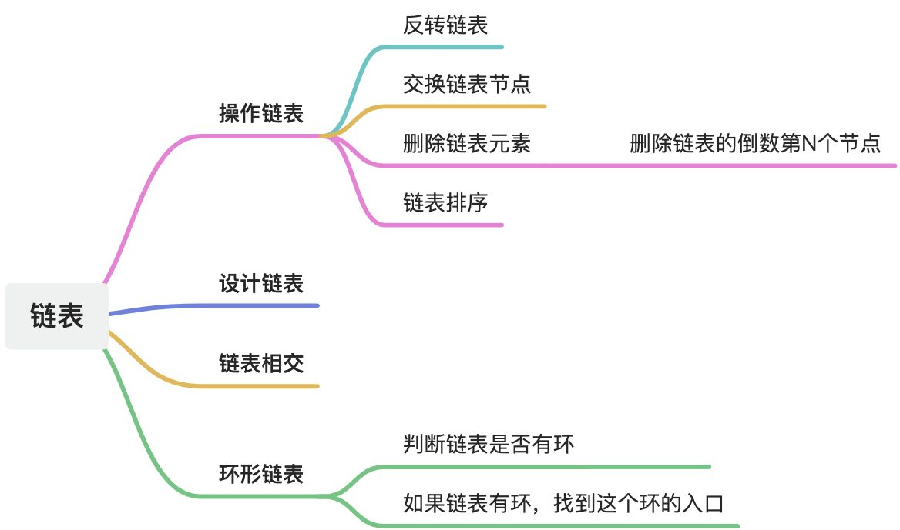

# 链表




### 删除链表元素
#### 注意点
##### 如何删除头节点
可以增加一个虚拟头节点。`return`时需要返回该虚拟头结点的`next`节点。


#### 经典题目
##### 题目
[leetcode 203 移除链表元素](https://leetcode.cn/problems/remove-linked-list-elements/description/)


##### 代码
```javascript
var removeElements = function(head, val) {
    const ret = new ListNode(0, head);
    let cur = ret;
    while(cur.next) {
        if(cur.next.val === val) {
            cur.next = cur.next.next;
            continue;
        }
        cur = cur.next;
    }
    return ret.next;
};
```


### 设计链表
#### 经典题目
##### 题目
[leetcode 707 设计链表](https://leetcode.cn/problems/design-linked-list/)

##### 代码
```javascript

class ListNode {
    constructor(val, next) {
        this.val = val;
        this.next = next;
    }
}

class MyLinkedList {
    constructor() {
        this._size = 0;
        this._head = null;
        this._tail = null;
    };
}

MyLinkedList.prototype.getNode = function(index) {
    if (index < 0 || index >= this._size) {
        return null;
    }

    let tmp = new ListNode(0, this._head);

    while(index-- >= 0) {
        tmp = tmp.next;
    }
    return tmp;
}

/** 
 * @param {number} index
 * @return {number}
 */
MyLinkedList.prototype.get = function(index) {
    if (index < 0 || index >= this._size) {
        return -1;
    }

    return this.getNode(index).val;
};

/** 
 * @param {number} val
 * @return {void}
 */
MyLinkedList.prototype.addAtHead = function(val) {
    const node = new ListNode(val, this._head);

    this._head = node;

    if (!this._tail) {
        this._tail = node;
    }
    this._size++;
};

/** 
 * @param {number} val
 * @return {void}
 */
MyLinkedList.prototype.addAtTail = function(val) {
    const node = new ListNode(val, null);

    if (this._tail) {
        this._tail.next = node;
    } else {
        this._head = node;
    }

    this._tail = node;
    this._size++;
};

/** 
 * @param {number} index 
 * @param {number} val
 * @return {void}
 */
MyLinkedList.prototype.addAtIndex = function(index, val) {
    if (index > this._size) return;

    if (index <= 0) {
        this.addAtHead(val);
        return;
    }

    if (index === this._size) {
        this.addAtTail(val);
        return;
    }

    const node = this.getNode(index - 1);

    node.next = new ListNode(val, node.next);

    this._size++;
};

/** 
 * @param {number} index
 * @return {void}
 */
MyLinkedList.prototype.deleteAtIndex = function(index) {
    if (index < 0 || index >= this._size) return;

    if (index === 0) {
        this._head = this._head.next;

        if (index = this._size - 1) {
            this._tail = this._head
        }
        this._size--;
        return;
    }

    const node = this.getNode(index - 1);

    node.next = node.next.next;

    if (index === this._size - 1) {
        this._tail = node;
    }

    this._size--;
};
```


### 反转链表
#### 经典题目
##### 题目
[leetcode 206 反转链表](https://leetcode.cn/problems/reverse-linked-list/)


##### 代码
```javascript
/**
 * @param {ListNode} head
 * @return {ListNode}
 */
var reverseList = function(head) {
    let pre = null, cur = head;

    while (cur) {
        const tmp = cur.next;
        cur.next = pre;
        pre = cur;
        cur = tmp;
    }

    return pre;
};
```


### 交换链表节点
#### 经典题目
##### 题目
[leetcode 24 两两交换链表中的节点](https://leetcode.cn/problems/swap-nodes-in-pairs/)


##### 代码
```javascript
var swapPairs = function(head) {
    const dummyHead = new ListNode(0, head);
    let tmp = dummyHead;

    while (tmp && tmp.next && tmp.next.next) {
        let pre = tmp.next;
        let cur = pre.next;
        let next = cur.next;

        tmp.next = cur;
        cur.next = pre;
        pre.next = next;

        tmp = pre;
    }

    return dummyHead.next;
};
```


### 删除链表的倒数第N个节点
#### 注意点
##### 如何找到倒数第n个节点
使用双指针`slow`、`fast`,让`fast`移动`n`步然后让`fast`和`slow`同时移动，直到fast指向链表末尾。slow所指向的节点就是要找的节点。


#### 经典题目
##### 题目
[leetcode 19 删除链表的倒数第N个结点](https://leetcode.cn/problems/remove-nth-node-from-end-of-list/)


##### 代码
```javascript
var removeNthFromEnd = function(head, n) {
    const dummyHead = new ListNode(0, head);
    let slow = dummyHead, fast = dummyHead;

    while (n--) {
        fast = fast.next;
    }

    while (fast.next) {
        fast = fast.next;
        slow = slow.next;
    }

    slow.next = slow.next.next;

    return dummyHead.next;
};
```


### 链表相交
#### 注意点
两个链表的头结点`headA`、`headB`。将两个链表的尾部对齐，将长的链表头部移到与短链表头部对齐。

此时我们就可以比较`curA`和`curB`是否相同，如果不相同，同时向后移动`curA`和`curB`，如果遇到`curA == curB`，则找到交点。

否则循环退出返回空指针。


#### 经典题目
##### 题目
[leetcode 面试题 02.07.链表相交](https://leetcode.cn/problems/intersection-of-two-linked-lists-lcci/)


##### 代码
```javascript
var getIntersectionNode = function(headA, headB) {
    // 计算两个链表的长度
    let newHeadA = headA, newHeadB = headB;
    
    const len1 = getLength(headA);
    const len2 = getLength(headB);

    if (len1 > len2) {
        let minus = len1 - len2;
        while (minus--) {
            newHeadA = newHeadA.next;
        }
    } else if (len2 > len1) {
        let minus = len2 - len1;
        while (minus--) {
            newHeadB = newHeadB.next;
        }
    }

    while (newHeadA && newHeadB) {
        if (newHeadA === newHeadB) {
            return newHeadA;
        }
        newHeadA = newHeadA.next;
        newHeadB = newHeadB.next;
    }

    return null;
};

function getLength(head) {
    let count = 0;
    while (head) {
        count++;
        head = head.next;
    }

    return count;
}
```


### 环形链表
#### 注意点
##### 判断链表是否有环
使用快慢指针法，分别定义 `fast` 和 `slow` 指针，从头结点出发，`fast`指针每次移动两个节点，`slow`指针每次移动一个节点，如果 `fast` 和 `slow`指针在途中相遇 ，说明这个链表有环。


##### 如果链表有环，如何找到这个环的入口
首先判断链表是否有环。如果链表有环的话，找到 `fast` 和 `slow`指针的交点 `cur`。在分别从 `head`和 `cur`节点移动。找到`head === cur`节点时，即为链表环的入口。


#### 经典题目
##### 题目
[leetcode 142 环形链表 II](https://leetcode.cn/problems/linked-list-cycle-ii/description/)


##### 代码
```javascript
var detectCycle = function(head) {
    // 一、hash
/*     const map = new Map;
    let index = 0;

    while (head) {
        if (!map.has(head)) {
            map.set(head, index);
        } else {
            return head;;
        }
        head = head.next;
        index++;
    }

    return null; */

    // 二、双指针
    if (!head || !head.next) return null;

    let slow = head.next, fast = head.next.next;

    while (fast && fast.next && fast !== slow) {
        slow = slow.next;
        fast = fast.next.next;
    }

    // 链表无环时
    if(!fast || !fast.next ) return null;

    slow = head;

    while (slow !== fast) {
        slow = slow.next;
        fast = fast.next;
    }

    return slow;
};
```


### 链表排序
#### 注意点
题目要求：在 `O(n log n)` 时间复杂度和常数级空间复杂度。


#### 思路
归并排序比较好处理此类问题。归并排序是先归(二分)，再合并，先将链表二分到不能再二分，即递归压栈压到链表只有一个节点(有序)，然后再递归出栈时进行合并，即将两个有序的链表合并。

合并两个有序的链表，合并后的结果返回给父调用，一层层向上，最后得出大问题的答案。


#### 经典题目
##### 题目
[leetcode 148 链表排序](https://leetcode.cn/problems/sort-list/description/)


##### 代码
```javascript
/**
 * Definition for singly-linked list.
 * function ListNode(val, next) {
 *     this.val = (val===undefined ? 0 : val)
 *     this.next = (next===undefined ? null : next)
 * }
 */
/**
 * @param {ListNode} head
 * @return {ListNode}
 */
var sortList = function(head) {
    if (!head || !head.next) return head;

    let slow = head, fast = head;

    let preSlow = null;

    while (fast && fast.next) {
        preSlow = slow;
        slow = slow.next;
        fast = fast.next.next;
    }

    preSlow.next = null;

    const l = sortList(head);
    const r = sortList(slow);

    return merge(l, r);
};

function merge(head1, head2) {
    const dummyHead = new ListNode();

    let pre = dummyHead;

    while (head1 && head2) {
        if (head1.val < head2.val) {
            pre.next = head1;
            head1 = head1.next;
        } else {
            pre.next = head2;
            head2 = head2.next;
        }
        pre = pre.next;
    }

    pre.next = head1 || head2;

    return dummyHead.next;
}
```

