# Vue2

# 系统图

# 详细学习路径
## 一、入门阶段
### 1. 工具函数与基础设施
相关代码: `src/shared/` 和 `src/core/util/`

学习内容:

+ 常用工具函数
+ 配置与常量
+ 错误处理机制
+ TypeScript类型定义

这部分代码相对简单，可以帮助你了解Vue的基础代码结构和编程风格。

### 2. 响应式系统基础
+ 相关代码: `src/core/observer/`，特别是 `dep.ts` 和 `watcher.ts`
+ 学习内容:
+ 观察者模式的实现
+ 依赖收集原理
+ 响应式数据的基本原理

这是Vue的核心特性之一，通过学习响应式系统的基础，可以理解Vue如何实现数据驱动视图。

### 3. 事件系统
+ 相关代码: `src/core/instance/events.ts`
+ 学习内容:
+ 事件的注册与触发
+ 事件修饰符的实现
+ 自定义事件处理

## 二、基础阶段
### 1. Vue实例创建与生命周期
+ 相关代码: `src/core/instance/` 目录下的多个文件
+ 学习内容:
+ Vue实例初始化过程
+ Vue生命周期钩子的实现
+ 各种实例方法的定义

### 2. 虚拟DOM基础概念
+ 相关代码: `src/core/vdom/vnode.ts` 和 `src/core/vdom/create-element.ts`
+ 学习内容:
+ VNode的结构和类型
+ createElement函数的实现
+ 虚拟DOM的基本概念

### 3. 响应式系统进阶
+ 相关代码: `src/core/observer/index.ts` 和 `src/core/observer/scheduler.ts`
+ 学习内容:
+ 深度响应式原理
+ 数组响应式处理
+ 异步更新队列

## 三、进阶阶段
### 1. 模板编译系统
+ 相关代码: `src/compiler/`
+ 学习内容:
+ HTML解析器
+ 文本解析器
+ 模板AST的生成
+ 代码生成

### 2. 渲染系统与Patch算法
+ 相关代码: `src/core/vdom/patch.ts`
+ 学习内容:
+ Diff算法实现
+ DOM更新优化
+ 节点的创建、更新和销毁

### 3. 组件系统
+ 相关代码: `src/core/vdom/create-component.ts` 和 `src/core/components/`
+ 学习内容:
+ 组件实例化过程
+ 组件更新机制
+ 内置组件的实现

## 四、高级阶段
### 1. 插件机制与全局API
+ 相关代码:` src/core/global-api/`
+ 学习内容:
+ 插件系统设计
+ 全局API的实现
+ 混入(mixin)机制

### 2. 指令系统
+ 相关代码: `src/compiler/directives/` 和 `src/core/vdom/modules/directives.ts`
+ 学习内容:
+ 指令的编译过程
+ 指令的运行时实现
+ 内置指令原理

### 3. 服务端渲染
+ 相关代码: `packages/server-renderer/`
+ 学习内容:
+ 服务端渲染原理
+ 客户端激活(hydration)
+ 同构渲染优化

### 4. 编译优化
+ 相关代码: `src/compiler/optimizer.ts`
+ 学习内容:
+ 静态节点优化
+ 代码生成优化
+ 运行时优化技巧

# 学习建议
1. 从小处入手：先理解Vue的基础设施和工具函数，再逐步深入到核心模块。
2. 理解设计思想：不要只关注代码实现，更要理解背后的设计思想和解决的问题。
3. 实践结合：在学习每个模块时，可以结合实际项目进行验证，加深理解。
4. 分阶段学习：按照上述划分的模块顺序学习，循序渐进，不要一次尝试理解所有内容。
5. 重点关注：响应式系统、虚拟DOM和编译系统是Vue的三大核心，应着重理解这三部分。
6. 跟踪数据流：通过跟踪数据从用户输入到视图更新的整个流程，可以更好地理解各个模块间的协作。

希望这个学习路径能帮助你系统地掌握Vue的源码！如果你有任何特定模块想深入了解，或者遇到理解障碍，随时可以提问。
