# nextTick

# 实现逻辑



# 设计理念
## 微任务优先
+ 优先使用微任务（microtask）而不是宏任务（macrotask）
+ 这样可以确保在 DOM 更新后尽快执行回调


## 降级策略
按照以下优先级顺序选择执行方式：

+ `Promise`（如果原生支持）
+ `MutationObserver`
+ `setImmediate`（仅 IE 和 Node.js）
+ `setTimeout`（最后的降级方案）


## 批量处理
+ 使用队列收集所有回调
+ 统一在下一个微任务/宏任务中执行
+ 避免多次触发更新


# 技术难点
## 跨平台兼容性处理
需要处理各种环境的特殊情况：

+ iOS UIWebView 的 Promise 问题
+ IE11 中 MutationObserver 的不稳定性
+ 不同平台的性能差异

```typescript
if (typeof Promise !== 'undefined' && isNative(Promise)) {
  // Promise 实现
} else if (!isIE && typeof MutationObserver !== 'undefined') {
  // MutationObserver 实现
} else if (typeof setImmediate !== 'undefined') {
  // setImmediate 实现
} else {
  // setTimeout 实现
}
```


## iOS 的特殊处理
在有问题的UIWebViews中，Promise.then并不是完全失效的，但它可能会卡在一个奇怪的状态中，回调函数被推入微任务队列中，但队列并没有被刷新，直到浏览器需要做一些其他的工作，例如处理定时器。因此，我们可以通过添加一个空的定时器来“强制”微任务队列被刷新。

```typescript
if (isIOS) setTimeout(noop)
```


## 错误处理 
需要妥善处理回调函数可能出现的错误，并保证不影响其他回调的执行。

```typescript
try {
  cb.call(ctx)
} catch (e: any) {
  handleError(e, ctx, 'nextTick')
}
```


## Promise 和回调的双模式支持
需要同时支持 Promise 和回调两种使用方式，并保证它们的行为一致性。

```typescript
export function nextTick(): Promise<void>
export function nextTick<T>(this: T, cb: (this: T, ...args: any[]) => any): void
```


## 状态管理
需要精确控制回调队列的状态，避免重复执行或遗漏执行。

```typescript
const callbacks: Array<Function> = []
let pending = false
```


# 性能优化考虑
## 批量处理优化
+ 使用数组存储回调，一次性处理所有回调
+ 通过 pending 标志避免重复触发 timerFunc

## 最小化开销
+ 优先使用微任务以减少执行延迟
+ 复用 Promise 实例而不是每次都创建新的


# 最小可用版 nextTick(JS)
```typescript
const callbacks = [];
let pending = false;

// 刷新并执行所有回调
function flushCallbacks() {
  pending = false;
  const copies = callbacks.slice(0);
  callbacks.length = 0;
  for (let i = 0; i < copies.length; i++) {
    copies[i]();
  }
}

// 选择最优的异步方法
let timerFunc;
if (typeof Promise !== 'undefined') {
  // 优先使用 Promise (微任务)
  const p = Promise.resolve();
  timerFunc = () => {
    p.then(flushCallbacks);
  };
} else {
  // 降级到 setTimeout (宏任务)
  timerFunc = () => {
    setTimeout(flushCallbacks, 0);
  };
}

function nextTick(cb) {
  // 将回调添加到队列
  let _resolve;
  callbacks.push(() => {
    if (cb) {
      try {
        cb();
      } catch (e) {
        console.error(e);
      }
    } else if (_resolve) {
      _resolve();
    }
  });
  
  // 如果不处于等待状态，触发异步执行
  if (!pending) {
    pending = true;
    timerFunc();
  }
  
  // 如果没有提供回调，返回 Promise
  if (!cb && typeof Promise !== 'undefined') {
    return new Promise(resolve => {
      _resolve = resolve;
    });
  }
}
```
