# 事件系统




# 事件注册与触发
+ `$on` - 注册事件监听器

```typescript
Vue.prototype.$on = function(
    event: string | Array<string>,
    fn: Function
  ): Component {
    const vm: Component = this
    if (isArray(event)) {
      // 如果事件名是数组，则为每个事件名都注册相同的处理函数
      for (let i = 0, l = event.length; i < l; i++) {
        vm.$on(event[i], fn)
      }
    } else {
      // 将事件处理函数添加到事件数组中
      ;(vm._events[event] || (vm._events[event] = [])).push(fn)
      // 特殊处理 hook: 前缀的事件
      if (event.startsWith('hook:')) {
        vm._hasHookEvent = true
      }
    }
    return vm
  }
```


+ `$once` - 注册只触发一次的事件监听器

`<font style="color:rgb(34, 34, 34);">on.fn = fn</font>`<font style="color:rgb(34, 34, 34);">的</font>**<font style="color:rgb(34, 34, 34);">本质目的</font>**<font style="color:rgb(34, 34, 34);">是建立原始回调</font>`<font style="color:rgb(34, 34, 34);">fn</font>`<font style="color:rgb(34, 34, 34);">与包装函数</font>`<font style="color:rgb(34, 34, 34);">on</font>`<font style="color:rgb(34, 34, 34);">的关联，使得后续通过</font>`<font style="color:rgb(34, 34, 34);">fn</font>`<font style="color:rgb(34, 34, 34);">移除事件监听时，Vue 能正确识别到实际绑定的</font>`<font style="color:rgb(34, 34, 34);">on</font>`<font style="color:rgb(34, 34, 34);">函数</font>

```typescript
Vue.prototype.$once = function (event: string, fn: Function): Component {
  const vm: Component = this

  // 创建包装函数
  function on() {
    vm.$off(event, on) // 在调用原始函数之前，先移除自身的监听器
    fn.apply(vm, arguments) // 调用原始事件处理函数
  }

  // 保存原始函数的引用, 当用户手动
  on.fn = fn

  // 注册包装函数作为事件监听器
  vm.$on(event, on)
  return vm
}
```


+ `$off` - 移除事件监听器

```typescript
Vue.prototype.$off = function(
  event?: string | Array<string>,
  fn?: Function
): Component {
  const vm: Component = this
  
  // 如果没有参数，移除所有事件监听器
  if (!arguments.length) {
    vm._events = Object.create(null)
    return vm
  }
  
  // 如果事件名是数组，递归调用$off移除每个事件
  if (isArray(event)) {
    for (let i = 0, l = event.length; i < l; i++) {
      vm.$off(event[i], fn)
    }
    return vm
  }
  
  // 获取指定事件的所有监听器
  const cbs = vm._events[event!]
  if (!cbs) {
    return vm
  }
  
  // 如果没有提供具体的处理函数，移除该事件的所有监听器
  if (!fn) {
    vm._events[event!] = null
    return vm
  }
  
  // 移除特定的监听器函数
  let cb
  let i = cbs.length
  while (i--) {
    cb = cbs[i]
    if (cb === fn || cb.fn === fn) {
      cbs.splice(i, 1)
      break
    }
  }
  return vm
}
```


+ `$emit` - 触发事件

```typescript
Vue.prototype.$emit = function(event: string): Component {
  const vm: Component = this
  
  // 开发环境下的事件名格式检查
  if (process.env.NODE_ENV !== 'production') {
    // 将事件名转换为小写进行比较，检查是否是HTML标准事件
    const lowerCaseEvent = event.toLowerCase()
    if (lowerCaseEvent !== event && vm._events[lowerCaseEvent]) {
      warn(
        `Event "${lowerCaseEvent}" is emitted in component ` +
          `${formatComponentName(vm)} but the handler is registered for "${event}". ` +
          `Note that HTML attributes are case-insensitive and you cannot use ` +
          `v-on to listen to camelCase events when using in-DOM templates. ` +
          `You should probably use "${hyphenate(event)}" instead of "${event}".`
      )
    }
  }
  
  // 获取该事件的所有监听器
  let cbs = vm._events[event]
  if (cbs) {
    cbs = cbs.length > 1 ? toArray(cbs) : cbs
    // 获取除事件名外的其他参数
    const args = toArray(arguments, 1)
    
    // 调用所有监听器函数
    for (let i = 0, l = cbs.length; i < l; i++) {
      try {
        cbs[i].apply(vm, args)
      } catch (e: any) {
        handleError(e, vm, `event handler for "${event}"`)
      }
    }
  }
  return vm
}
```


# 事件修饰符
Vue 的事件修饰符（如 `.stop`、`.prevent` 等）主要在编译阶段处理，不是在 `events.ts` 中实现的。它们在模板编译时被转换为相应的代码。

例如，当你使用 @click.stop 时，编译器会生成类似以下代码：

```typescript
function($event) {
  $event.stopPropagation();
  // 原始的事件处理代码
}
```


# 自定义事件
Vue 组件可以通过 `$on`、`$emit` 等方法实现自定义事件的处理。此外，Vue 还提供了 `updateComponentListeners` 函数来处理组件间的事件传递。


# 常见面试题
## 基础概念题
+ Vue 中事件处理的核心方法有哪些？它们各自的作用是什么？
    - $on: 注册事件监听器
    - $once: 注册只触发一次的事件监听器
    - $off: 移除事件监听器****
    - $emit: 触发事件
+ Vue 组件实例的事件系统是基于什么设计模式实现的？
    - 基于发布-订阅模式（观察者模式）实现，通过 `_events` 对象存储所有事件监听器
+ Vue 中的 `_events` 对象是什么？它在事件系统中扮演什么角色？
    - `_events` 是 Vue 实例上存储所有事件监听器的对象
    - 它作为事件名到事件处理函数数组的映射表

## 实现原理题
+ Vue 的 $once 方法是如何实现只执行一次的功能的？
    - 创建一个包装函数，在调用原始函数前先调用 $off 移除自身
    - 将包装函数通过 $on 注册为事件监听器
    - 在包装函数上添加 fn 属性引用原始函数，用于 $off 时匹配
+ Vue 如何处理多个事件名的监听？例如 $on(['event1', 'event2'], callback)
    - 通过检测事件名是否为数组
    - 如果是数组，则遍历数组中的每个事件名，递归调用 $on 方法
+ Vue 中 $emit 方法的实现原理是什么？
    - 获取事件名对应的所有监听器函数
    - 将除事件名外的其他参数作为参数传递给监听器函数
    - 依次调用所有监听器函数，并进行错误处理
+ Vue 如何处理事件监听器的移除？特别是针对特定事件的特定处理函数？
    - 通过 $off 方法实现
    - 如果不提供参数，移除所有事件监听器
    - 如果只提供事件名，移除该事件的所有监听器
    - 如果提供事件名和处理函数，则通过遍历比较找到匹配的处理函数并移除

## 高级应用题
+ Vue 中的 hook: 前缀事件有什么特殊之处？它们在什么场景下使用？
    - 以 hook: 开头的事件是生命周期钩子事件
    - Vue 通过 _hasHookEvent 标志优化这类事件的处理
    - 可用于监听组件生命周期钩子，例如 $on('hook:mounted', callback)
+ Vue 如何处理父组件传递给子组件的事件监听器？
    - 通过 initEvents 方法初始化
    - 从 $options._parentListeners 获取父组件传递的监听器
    - 调用 updateComponentListeners 方法进行处理
+ Vue 中的事件名大小写敏感性问题是如何处理的？
    - HTML 属性不区分大小写，但 JavaScript 区分大小写
    - 在开发环境下，Vue 会检测事件名大小写不一致的情况并给出警告
    - 建议使用 kebab-case（短横线分隔）命名事件

## 实际应用题
+ 如何实现一个自定义事件总线（EventBus）来实现非父子组件间的通信？
    - 创建一个全局 Vue 实例作为事件中心
    - 使用 $on、$emit 方法进行事件注册和触发
    - 注意在组件销毁时使用 $off 移除事件监听器避免内存泄漏
+ Vue 3 中移除了 $on、$off 和 $once 方法，如何迁移这些用法？
    - 使用外部事件库如 mitt 或 tiny-emitter
    - 使用 Vuex 或 Pinia 进行状态管理
    - 使用 provide/inject 或组合式 API
+ 如何在组件销毁时自动清理所有事件监听器？
    - 在 beforeDestroy 或 beforeUnmount 生命周期钩子中调用 $off()
    - 或者在使用 EventBus 时手动跟踪并移除添加的事件监听器

## 性能优化题
+ Vue 事件系统中有哪些性能优化措施？
    - 使用 _hasHookEvent 标志优化钩子事件检测
    - 事件处理函数的惰性创建和缓存
    - 在 $off 中使用高效的数组操作移除监听器
+ 如何避免使用 Vue 事件系统时的常见内存泄漏问题？
    - 组件销毁时移除事件监听器
    - 避免在全局事件总线上注册大量事件而不清理
    - 使用 $once 代替 $on 处理一次性事件
