# 响应式系统基础

# 系统流程图



# 学习路径



# 知识点
## 观察者模式：
+ `Observable`（被观察对象）：数据对象
+ `Observer`（观察者）：`Watcher`实例
+ `Dep`（依赖管理器）：连接数据与观察者的桥梁


## 依赖收集原理：
+ 每个响应式属性对应一个Dep实例
+ `Watcher`执行时设置为全局`Dep.target`
+ 数据`getter`触发时调用`dep.depend()`收集依赖
+ 数据`setter`触发时调用`dep.notify()`通知更新


## 响应式数据原理：
+ 数据劫持（`Object.defineProperty`或`Proxy`）
+ `getter`收集依赖，`setter`通知更新
+ 数组方法重写实现数组响应式


## 核心类与方法
| 类名 | 作用 | 关键方法 |
| --- | --- | --- |
| Observer | 将普通对象转为响应式对象 | observe、defineReactive |
| Dep | 收集依赖并通知更新 | depend、notify、addSub、removeSub |
| Watcher | 观察数据变化并执行回调 | get、update、run、addDep |


## 最小可用版(JS)
```typescript
// Dep类：依赖管理器
class Dep {
  constructor() {
    this.subscribers = new Set();
  }
  depend() {
    if (activeEffect) {
      this.subscribers.add(activeEffect);
    }
  }
  notify() {
    this.subscribers.forEach(effect => effect());
  }
}

let activeEffect = null;
function watchEffect(effect) {
  activeEffect = effect;
  effect();
  activeEffect = null;
}

// 响应式数据函数
function reactive(obj) {
  Object.keys(obj).forEach(key => {
    let internalValue = obj[key];
    const dep = new Dep();

    Object.defineProperty(obj, key, {
      get() {
        dep.depend();
        return internalValue;
      },
      set(newVal) {
        internalValue = newVal;
        dep.notify();
      }
    });
  });
  return obj;
}

// 测试示例
const state = reactive({ count: 0 });

watchEffect(() => {
  console.log(`count is: ${state.count}`);
});

state.count++; // 自动触发更新
```


# 常见题目
+ Vue响应式原理是什么？

数据劫持、依赖收集、观察者模式、发布订阅模式。

+ Vue如何实现数组的响应式？

重写数组原型方法（push、pop、shift、unshift、splice、sort、reverse）。

+ 为什么Vue2使用Object.defineProperty而Vue3使用Proxy？

Proxy可以直接监听对象而非属性，支持数组和新增属性的监听，性能更好。

+ Vue响应式系统中Dep和Watcher的作用分别是什么？

Dep负责收集依赖并通知更新，Watcher负责观察数据变化并执行回调。

+ 如何实现一个简单的响应式系统？

手写最小版响应式系统。


# 自我考核
### 阶段一：理论考核（自测）
+ 能否清晰解释响应式系统的核心概念？
+ 能否画出响应式系统的流程图？
+ 能否解释Dep、Watcher、Observer的作用及关系？

### 阶段二：代码实现考核（动手实践）
+ 手写最小版响应式系统（如上所示）
+ 实现数组响应式（重写数组方法）
+ 实现计算属性和侦听器功能

### 阶段三：源码阅读考核（深入理解）
+ 阅读并注释Vue源码中dep.ts、watcher.ts、observer/index.ts文件
+ 能否解释源码中每个方法的作用及调用关系？

### 阶段四：面试模拟考核（实战演练）
+ 模拟面试场景，回答常见面试题
+ 现场手写响应式系统代码
+ 解释代码实现原理及优化方案
