# 工具函数




# 类型检测与判断
## 基础类型检测
+ 基础类型使用`typeof`直接判断

```typescript
export function isPrimitive(value: any): boolean {
  return (
    typeof value === 'string' ||
    typeof value === 'number' ||
    typeof value === 'symbol' ||
    typeof value === 'boolean'
  )
}

export function isFunction(value: any): value is (...args: any[]) => any {
  return typeof value === 'function'
}

export function isObject(obj: any): boolean {
  return obj !== null && typeof obj === 'object'
}
```


+ 对象类型使用`Object.prototype.toString`精确判断

```typescript
const _toString = Object.prototype.toString

export function toRawType(value: any): string {
  return _toString.call(value).slice(8, -1)
}

export function isPlainObject(obj: any): boolean {
  return _toString.call(obj) === '[object Object]'
}

export function isRegExp(v: any): v is RegExp {
  return _toString.call(v) === '[object RegExp]'
}

export function toRawType(value: any): string {
  return _toString.call(value).slice(8, -1)
}
```


+ Promise检测采用特征判断法（存在`then/catch`方法）

可能有误判（任何包含`then/catch`方法的对象都会通过检测）

```typescript
export function isDef<T>(v: T): v is NonNullable<T> {
  return v !== undefined && v !== null
}

export function isPromise(val: any): val is Promise<any> {
  return (
    isDef(val) &&
    typeof val.then === 'function' &&
    typeof val.catch === 'function'
  )
}
```


+ 数组索引验证包含类型转换和数学验证

数组索引验证会先将值转换为字符串再解析数字

```typescript
export function isValidArrayIndex(val: any): boolean {
  const n = parseFloat(String(val))
  return n >= 0 && Math.floor(n) === n && isFinite(val)
}
```


## 环境检测
+ `hasProto`: 检测环境是否支持`__proto__`

```typescript
export const hasProto = '__proto__' in {}
```


+ `inBrowser`: 检测是否在浏览器环境

```typescript
export const inBrowser = typeof window !== 'undefined'
```


+ `isIE`, `isIE9`, `isEdge`: 浏览器类型检测

```typescript
export const isIE = UA && /msie|trident/.test(UA)
export const isIE9 = UA && UA.indexOf('msie 9.0') > 0
export const isEdge = UA && UA.indexOf('edge/') > 0
```


+ `isAndroid`, `isIOS`: 设备类型检测

```typescript
export const isAndroid = UA && UA.indexOf('android') > 0
export const isIOS = UA && /iphone|ipad|ipod|ios/.test(UA)
```


+ `isServerRendering`: 检测是否为服务器渲染环境

```typescript
let _isServer
export const isServerRendering = () => {
  if (_isServer === undefined) {
    /* istanbul ignore if */
    if (!inBrowser && typeof global !== 'undefined') {
      // detect presence of vue-server-renderer and avoid
      // Webpack shimming the process
      _isServer =
        global['process'] && global['process'].env.VUE_ENV === 'server'
    } else {
      _isServer = false
    }
  }
  return _isServer
}
```


+ `isNative`: 检测函数是否为原生实现

原生函数的`toString()`方法会返回包含"native code"字符串的内容

```typescript
export function isNative(Ctor: any): boolean {
  return typeof Ctor === 'function' && /native code/.test(Ctor.toString())
}

// 例如在nextTick实现中判断Promise的可用性：
 if (typeof Promise !== 'undefined' && isNative(Promise)) {
   // 使用原生Promise实现
 }
```


+ `hasSymbol`: 检测环境是否支持Symbol

`hasSymbol`是一个布尔值常量，用于检测当前环境是否支持原生`Symbol`和`Reflect`特性。

这个检测非常严格，因为Vue在某些功能中需要依赖这些原生特性来保证性能和功能的正确性。

```typescript
export const hasSymbol =
  typeof Symbol !== 'undefined' &&
  isNative(Symbol) &&
  typeof Reflect !== 'undefined' &&
  isNative(Reflect.ownKeys

// 例如在响应式系统中处理对象属性时的优化
const keys = hasSymbol
  ? Reflect.ownKeys(from)
  : Object.keys(from)  
```


# 数据处理与转换
## 对象处理
+ `extend`: 将属性混合到目标对象

```typescript
declare type PropertyKey = string | number | symbol;

export function extend(
  to: Record<PropertyKey, any>,
  _from?: Record<PropertyKey, any>
): Record<PropertyKey, any> {
  for (const key in _from) {
    to[key] = _from[key]
  }
  return to
}
```


+ `toObject`: 将数组转换为对象

```typescript
export function toObject(arr: Array<any>): object {
  const res = {}
  for (let i = 0; i < arr.length; i++) {
    if (arr[i]) {
      extend(res, arr[i])
    }
  }
  return res
}
```


+ `hasOwn`: 检查对象是否拥有特定属性

```typescript
const hasOwnProperty = Object.prototype.hasOwnProperty
export function hasOwn(obj: Object | Array<any>, key: string): boolean {
  return hasOwnProperty.call(obj, key)
}
```


+ `hasChanged`: 检查两个值是否不相等

```typescript
export function hasChanged(x: unknown, y: unknown): boolean {
  if (x === y) {
    // 处理+0和-0
    return x === 0 && 1 / x !== 1 / (y as number)
  } else {
    // 处理NaN
    return x === x || y === y
  }
}
```


## 字符串处理
+ `toString`: 将值转换为实际渲染的字符串

```javascript
const _toString = Object.prototype.toString
```


+ `toNumber`: 将输入值转换为数字

```javascript
export function toNumber(val: string): number | string {
  const n = parseFloat(val)
  return isNaN(n) ? val : n
}
```


+ `camelize`: 将连字符分隔的字符串转换为驼峰式

```javascript
export function cached<R>(fn: (str: string) => R): (sr: string) => R {
  const cache: Record<string, R> = Object.create(null)
  return function cachedFn(str: string) {
    const hit = cache[str]
    return hit || (cache[str] = fn(str))
  }
}

const camelizeRE = /-(\w)/g

export const camelize = cached((str: string): string => {
  return str.replace(camelizeRE, (_, c) => (c ? c.toUpperCase() : ''))
})
```


+ `capitalize`: 首字母大写

```typescript
export const capitalize = cached((str: string): string => {
  return str.charAt(0).toUpperCase() + str.slice(1)
})
```


+ `hyphenate`: 将驼峰式字符串转换为连字符分隔

```typescript
const hyphenateRE = /\B([A-Z])/g
export const hyphenate = cached((str: string): string => {
  return str.replace(hyphenateRE, '-$1').toLowerCase()
})
```


## 数组处理
+ `toArray`: 将类数组对象转换为真实数组

```typescript
export function toArray(list: any, start?: number): Array<any> {
  start = start || 0
  let i = list.length - start
  const ret: Array<any> = new Array(i)
  while (i--) {
    ret[i] = list[i + start]
  }
  return ret
}
```


+ `remove`: 从数组中移除项目

```typescript
export function remove(arr: Array<any>, item: any): Array<any> | void {
  const len = arr.length
  if (len) {
    // fast path for the only / last item
    if (item === arr[len - 1]) {
      arr.length = len - 1
      return
    }
    const index = arr.indexOf(item)
    if (index > -1) {
      return arr.splice(index, 1)
    }
  }
}
```


+ `looseEqual`: 宽松相等比较

```typescript
export function looseEqual(a: any, b: any): boolean {
  if (a === b) return true
  const isObjectA = isObject(a)
  const isObjectB = isObject(b)
  if (isObjectA && isObjectB) {
    try {
      const isArrayA = Array.isArray(a)
      const isArrayB = Array.isArray(b)
      // 两个数组对比
      if (isArrayA && isArrayB) {
        return (
          a.length === b.length &&
          a.every((e: any, i: any) => {
            return looseEqual(e, b[i])
          })
        )
      } else if (a instanceof Date && b instanceof Date) {
        // 日期对象
        return a.getTime() === b.getTime()
      } else if (!isArrayA && !isArrayB) {
        // 两个对象对比
        const keysA = Object.keys(a)
        const keysB = Object.keys(b)
        return (
          keysA.length === keysB.length &&
          keysA.every(key => {
            return looseEqual(a[key], b[key])
          })
        )
      } else {
        // 其他场景
        return false
      }
    } catch (e: any) {
      // 循环报错
      return false
    }
  } else if (!isObjectA && !isObjectB) {
    // 非对象比较
    return String(a) === String(b)
  } else {
    // 非对象与对象比较, 返回false
    return false
  }
}
```


+ `looseIndexOf`: 使用宽松相等查找索引

```typescript
export function looseIndexOf(arr: Array<unknown>, val: unknown): number {
  for (let i = 0; i < arr.length; i++) {
    if (looseEqual(arr[i], val)) return i
  }
  return -1
}
```


# 缓存与性能优化
+ cached: 创建纯函数的缓存版本

```typescript
export function cached<R>(fn: (str: string) => R): (sr: string) => R {
  const cache: Record<string, R> = Object.create(null)
  return function cachedFn(str: string) {
    const hit = cache[str]
    return hit || (cache[str] = fn(str))
  }
}
```


+ once: 确保函数只被调用一次

```typescript
export function once<T extends (...args: any[]) => any>(fn: T): T {
  let called = false
  return function () {
    if (!called) {
      called = true
      fn.apply(this, arguments as any)
    }
  } as any
}
```


+ noop: 空函数，用于默认值和占位

```typescript
export function noop(a?: any, b?: any, c?: any) { }
```


+ identity: 返回相同的值，用于默认转换器

```typescript
export const identity = (_: any) => _
```


+ makeMap: 创建快速查找映射

```typescript
export function makeMap(
  str: string,
  expectsLowerCase?: boolean
): (key: string) => true | undefined {
  const map = Object.create(null)
  const list: Array<string> = str.split(',')
  for (let i = 0; i < list.length; i++) {
    map[list[i]] = true
  }
  return expectsLowerCase ? val => map[val.toLowerCase()] : val => map[val]
}
```

# 其他
## 选项处理与合并


## 常量定义
```typescript
// 服务器渲染属性标识
export const SSR_ATTR = 'data-server-rendered'

// 资源类型
export const ASSET_TYPES = ['component', 'directive', 'filter'] as const

// 生命周期钩子名称列表
export const LIFECYCLE_HOOKS = [
  'beforeCreate',
  'created',
  'beforeMount',
  'mounted',
  'beforeUpdate',
  'updated',
  'beforeDestroy',
  'destroyed',
  'activated',
  'deactivated',
  'errorCaptured',
  'serverPrefetch',
  'renderTracked',
  'renderTriggered'
] as const

```
