# Vue实例创建与生命周期

# 流程
## Vue 实例初始化过程



## Vue 生命周期钩子的执行流程



Vue实例的创建和生命周期是Vue框架的核心部分，通过模块化的设计，将不同的功能分散到不同的文件中，使得代码结构清晰、易于维护。整个初始化过程是一个线性的流程，从创建实例到挂载组件，每个步骤都有明确的职责。生命周期钩子的设计使得开发者可以在特定的时机执行自定义逻辑，增强了框架的灵活性和可扩展性。

Vue的实例方法通过多个Mixin函数添加到Vue.prototype上，这种设计使得代码更加模块化，每个Mixin负责一类功能，如**状态管理**、**事件管理**、**生命周期管理**和**渲染管理**等。这种设计也使得Vue的功能可以按需引入，提高了框架的可定制性。


# Vue实例的主要组成部分
## 初始化过程（init.ts）：
`initMixin`：定义Vue实例的`_init`方法，负责整个Vue实例的初始化过程

```typescript
Vue.prototype._init = function (options?: Record<string, any>) {
  const vm: Component = this;

  // 唯一标识实例的_uid，用于调试或追踪
  vm._uid = uid++;

  // 性能监测相关（开发环境）
  let startTag, endTag;
  if (__DEV__ && config.performance && mark) {
    startTag = `vue-perf-start:${vm._uid}`;
    endTag = `vue-perf-end:${vm._uid}`;
    mark(startTag); // 记录初始化开始时间
  }

  // 标识为Vue实例，避免被响应式系统观察
  vm._isVue = true;
  // 跳过响应式处理
  vm.__v_skip = true;
  
  // 初始化作用域（用于管理副作用，如Vue 3的EffectScope）
  vm._scope = new EffectScope(true /* detached */);
  vm._scope.parent = undefined; // 独立作用域，不继承父级
  vm._scope._vm = true; // 标识作用域关联的VM实例

  // 合并选项：区分内部组件和普通组件
  if (options && options._isComponent) {
    // 内部组件优化合并（跳过动态选项合并提升性能）
    initInternalComponent(vm, options);
  } else {
    // 合并构造函数选项和用户传入的options
    vm.$options = mergeOptions(
      resolveConstructorOptions(vm.constructor), // 解析构造函数默认选项
      options || {},
      vm
    );
  }

  // 开发环境初始化渲染代理（用于模板编译时的错误提示）
  if (__DEV__) {
    initProxy(vm); // 设置代理拦截非法属性访问
  } else {
    vm._renderProxy = vm; // 生产环境直接使用实例
  }

  // 暴露实例自身引用
  vm._self = vm;

  // 核心初始化流程
  initLifecycle(vm);     // 初始化父子组件关系、$parent/$children
  initEvents(vm);        // 初始化自定义事件监听
  initRender(vm);        // 初始化插槽、渲染函数、createElement绑定

  // 调用 beforeCreate 钩子（此时未初始化数据与事件）
  callHook(vm, 'beforeCreate', undefined, false /* 不设置上下文 */);

  // 初始化注入（从祖先组件获取注入数据）
  initInjections(vm);   // resolve injections before data/props
  // 初始化状态：data/props/methods/computed/watch
  initState(vm);
  // 初始化提供（为后代组件提供数据）
  initProvide(vm);      // resolve provide after data/props

  // 调用 created 钩子（已完成数据观测，但未挂载DOM）
  callHook(vm, 'created');

  // 开发环境性能监测收尾
  if (__DEV__ && config.performance && mark) {
    vm._name = formatComponentName(vm, false); // 格式化组件名
    mark(endTag); // 记录结束时间
    measure(`vue ${vm._name} init`, startTag, endTag); // 计算初始化耗时
  }

  // 自动挂载：若指定了el选项，则调用$mount
  if (vm.$options.el) {
    vm.$mount(vm.$options.el);
  }
};
```


## 生命周期管理（lifecycle.ts）：
+ `initLifecycle`：初始化生命周期相关属性
+ `lifecycleMixin`：定义`_update`、`$forceUpdate`和`$destroy`方法
+ `mountComponent`：组件挂载的核心方法
+ `callHook`：调用生命周期钩子的方法

## 状态管理（state.ts）：
`initState`：初始化Vue实例的状态

+ `initProps`：初始化props
+ `initData`：初始化data
+ `initComputed`：初始化计算属性
+ `initWatch`：初始化侦听器
+ `stateMixin`：定义`$data`、`$props`、`$set`、`$delete`和`$watch`方法

## 事件系统（events.ts）：
+ `initEvents`：初始化事件系统
+ `eventsMixin`：定义`$on`、`$once`、`$off`和`$emit`方法
+ `updateComponentListeners`：更新组件监听器

## 渲染系统（render.ts）：
+ `initRender`：初始化渲染相关属性
+ `renderMixin`：定义`$nextTick`和`_render`方法

# Vue实例方法的定义
Vue实例的方法是通过多个Mixin函数添加到Vue.prototype上的：

## 核心方法：
+ `_init`：通过`initMixin`添加，负责初始化Vue实例
+ `$data`、`$props`、`$set`、`$delete`、`$watch`：通过stateMixin添加，负责状态管理
+ `$on`、`$once`、`$off`、`$emit`：通过eventsMixin添加，负责事件管理
+ `_update`、`$forceUpdate`、`$destroy`：通过lifecycleMixin添加，负责生命周期管理
+ `$nextTick`、`_render`：通过renderMixin添加，负责渲染管理

## 生命周期钩子：
+ `beforeCreate`、`created`、`beforeMount`、`mounted`、`beforeUpdate`、`updated`、`beforeDestroy`、`destroyed`、`activated`、`deactivated`
+ 这些钩子通过`callHook`函数调用，该函数会遍历对应钩子数组并执行

# Vue实例创建的关键步骤
1. 创建Vue构造函数：在src/core/instance/index.ts中定义
2. 通过各种Mixin扩展Vue原型：添加各种实例方法
3. 调用_init方法初始化实例：在创建Vue实例时自动调用
4. 合并配置选项：将用户传入的选项与默认选项合并
5. 初始化各种功能：生命周期、事件、渲染、状态等<sub>****</sub>
6. 调用生命周期钩子：在适当的时机调用对应的钩子函数
7. 挂载组件：如果提供了el选项，则自动挂载
