# 虚拟DOM基础概念

# 虚拟 DOM 的基本概念
虚拟DOM（Virtual DOM）是一种编程概念，其中UI的理想或"虚拟"表示保存在内存中，并通过诸如ReactDOM等库与"真实"DOM同步。这个过程称为协调（reconciliation）。

在Vue中，虚拟DOM是一个轻量级的JavaScript对象，它是真实DOM的一种表示。当应用状态改变时，Vue会生成新的虚拟DOM树，并与旧的虚拟DOM树进行比较（diff算法），然后只更新真实DOM中需要变化的部分，从而提高性能。

## VNode的结构和类型
`VNode` 从代码中可以看到，`VNode`是Vue中表示虚拟DOM节点的核心类。每个`VNode`实例代表DOM树中的一个节点。

## VNode 类
VNode的主要属性包括：

1. tag: 标签名，如'div'、'span'等
2. data: 节点的数据对象，包含属性、指令等信息
3. children: 子节点数组
4. text: 文本内容
5. elm: 对应的真实DOM节点
6. context: 渲染该节点的组件实例
7. key: 节点的唯一标识，用于优化更新过程
8. componentOptions: 组件选项
9. componentInstance: 组件实例
10. isComment: 是否为注释节点
11. isStatic: 是否为静态节点（不会变化的节点）
12. isCloned: 是否为克隆节点

## VNode 的类型
Vue中有几种主要的VNode类型：

1. 元素节点：表示普通HTML元素，如div、span等
2. 组件节点：表示Vue组件
3. 文本节点：表示纯文本内容
4. 注释节点：表示HTML注释
5. 克隆节点：通过cloneVNode函数创建的节点副本

代码中提供了几个创建不同类型VNode的辅助函数：

+ `createEmptyVNode`: 创建一个空的注释节点
+ `createTextVNode`: 创建一个文本节点
+ `cloneVNode`: 克隆一个现有的VNode

# createElement函数的实现
## _createElement函数的主要步骤
+ 参数处理：处理传入的参数，包括上下文、标签、数据、子节点和规范化类型
+ 数据验证：检查数据是否为响应式对象，如果是则发出警告
+ 标签处理：处理标签，包括处理动态组件:is属性
+ 子节点规范化：根据规范化类型对子节点进行规范化处理
+ 创建VNode：
    - 如果标签是字符串：
        * 如果是平台内置标签（如div、span），创建普通元素VNode
        * 如果是已注册的组件，创建组件VNode
        * 否则创建未知标签的VNode
    - 如果标签不是字符串（可能是组件选项或构造函数），创建组件VNode
+ 应用命名空间：如果需要，应用XML命名空间
+ 注册深层绑定：处理样式和类的深层绑定
+ 返回VNode：返回创建的VNode

# 虚拟 DOM 的工作流程

# 虚拟DOM的优势
1. 性能优化：通过最小化DOM操作，提高渲染性能
2. 跨平台能力：虚拟DOM是平台无关的，可以渲染到不同的平台（如浏览器DOM、服务器端渲染、原生移动应用等）
3. 声明式编程：开发者只需关注状态变化，而不需要手动操作DOM
4. 组件化：便于实现组件化开发模式

# 总结
Vue的虚拟DOM系统是其响应式渲染的核心。通过VNode类表示DOM节点，通过createElement函数创建虚拟DOM树，然后通过diff算法计算最小DOM操作，最终更新真实DOM。这种方式既提高了性能，又简化了开发者的工作。

虚拟DOM的核心思想是将DOM操作的复杂性抽象出来，让开发者专注于应用状态和UI的声明式描述，而不是命令式的DOM操作。这也是Vue等现代前端框架能够提供高效、简洁开发体验的关键所在。
