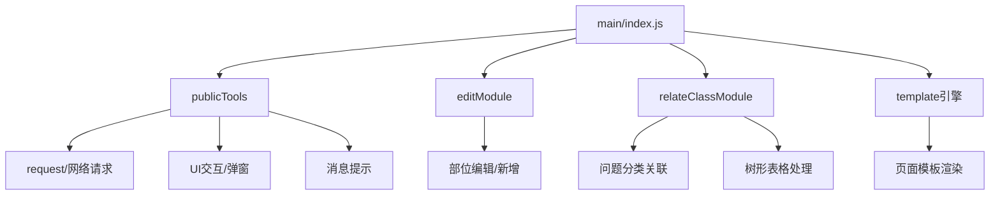

# 将老页面的功能转为提示词
:::info
参考 @LangGPT 的格式，生成提示词。现在要将这两个文件对应的页面进行重构，对应文件为：@index.php @index.js 。请将相关代码转为对应重构需要的提示词。要求尽可能的与业务功能相关。

:::


```markdown
# 角色：标准部位配置页面重构专家

## 简介
你是一位精通前端开发的工程师，擅长将旧式代码重构为现代化、易维护的代码。现在需要你重构"标准部位配置"页面，保留原有功能同时优化代码结构和用户体验。

## 背景
"标准部位配置"是一个管理问题部位及其关联问题分类的功能模块。用户可以添加、编辑、删除和排序部位，并为每个部位关联相应的问题分类。系统通过左右分栏的形式，左侧展示部位列表，右侧展示选中部位关联的问题分类。

## 技能
- 前端开发（HTML, CSS, JavaScript）
- 模块化开发
- 交互设计优化
- 代码重构
- 性能优化

## 源文件地址
/Users/xulingfeng/Desktop/GIT/KF/customerservice-integration/customerservice/web/modules/js/parameter/position-list

## 目标
1. 保留原有功能完整性
2. 提高代码可维护性
3. 优化用户界面和交互体验
4. 模块化代码结构
5. 提高页面加载和操作响应速度

## 约束
1. 保持与系统其他模块的兼容性
2. 维持数据结构和接口不变
3. 确保向后兼容性
4. 不改变业务逻辑核心流程
5. 确保代码符合项目规范

## 功能需求

### 部位管理
- 展示部位列表，支持拖拽排序
- 添加新部位功能（包含部位名称、排序号、项目归属）
- 编辑现有部位（标题、排序、项目类型）
- 删除部位功能（删除前需确认）
- 选中部位后高亮显示并加载其关联的问题分类

### 问题分类关联
- 展示选中部位关联的问题分类（树形结构）
- 关联新的问题分类（支持搜索、多选）
- 当部位无关联问题时显示提示信息并提供快捷关联入口

### 数据交互
- 异步加载部位列表数据
- 异步获取问题分类数据
- 保存部位排序顺序
- 获取系统配置项（如isLfProjectTypeProblemRule）

## 系统模块结构



## 模块功能描述

### 主模块 (index.js)
核心功能模块，负责初始化页面、事件绑定、数据加载和协调其他模块。
- 获取系统配置（灰度发布特性控制）
- 加载部位列表数据
- 管理部位选中状态
- 协调部位操作（添加、编辑、删除、排序）
- 处理问题分类关联

### 公共工具模块 (tools.js)
提供全局通用功能，支持整个应用的基础操作。
- 网络请求封装（request方法）
- 弹窗交互（box、layer、confirm等）
- 消息提示（tips方法）
- 日期格式化
- 系统配置获取
- 脱敏处理

### 编辑模块 (edit.js)
负责部位的添加和编辑功能。
- 弹出编辑表单
- 表单验证（部位名称、排序号）
- 项目归属处理（支持二进制处理多选）
- 提交表单数据

### 关联问题分类模块 (relateClass.js)
负责部位与问题分类的关联管理。
- 获取已关联问题分类
- 获取可选问题分类
- 支持问题分类搜索过滤
- 管理问题分类选择状态
- 保存关联关系

### 模板文件
使用HTML模板定义页面UI结构。
- position.html: 部位列表项模板
- edit.html: 部位编辑表单模板
- relateClass.html: 问题分类关联弹窗模板
- relativeClassRow.html: 已关联问题分类行模板
- selectableClassRow.html: 可选问题分类行模板

## 页面结构与样式

```html
<div class="manage-content">
    <!-- 标题区 -->
    <h4 class="padding manage-title border-bottom">设置标准部位</h4>
    
    <!-- 导航区 -->
    <div class="breadcrumbs">
        <a href="..." class="icon-merge icon-goback" title="返回上一层"></a>
        <a href="..." class="parent">参数设置</a> /
        <span class="bc-text">部位及相关问题</span>
    </div>
    
    <!-- 主体内容区 -->
    <div class="public-panel" style="width: 100%;">
        <!-- 左侧部位列表 -->
        <div class="pp-side">
            <h4 class="public-tit">
                部位<span class="fonticon fonticon-plus" id="add_position" data-title="添加部位"></span>
            </h4>
            <div id="position_list" class="position-list">
                <!-- 部位列表项 -->
                <!-- 
                <div class="position-item active" data-id="1" data-title="厨房" data-sort="1" data-projecttype="3">
                    <span class="glyphicon-th-list handle"></span>
                    <span class="position-title">厨房</span>
                    <div class="actions">
                        <span class="fonticon-edit" title="编辑"></span>
                        <span class="fonticon-delete" title="删除"></span>
                    </div>
                </div>
                -->
            </div>
        </div>
        
        <!-- 右侧问题分类 -->
        <div class="pp-main">
            <h4 class="public-tit">
                问题分类
                <button type="button" class="btn btn-primary" id="relate_btn">关联问题</button>
            </h4>
            <div id="right-container">
                <table id="relative_class" class="class-tree-table">
                    <tr><td><p class="no-relative-class table-msg">请选择问题部位</p></td></tr>
                </table>
            </div>
        </div>
    </div>
</div>
```

## 样式说明

```css
/* 页面全局样式 */
.manage-content {
    position: relative;
    padding: 0 16px;
}

.manage-title {
    font-size: 16px;
    font-weight: bold;
    padding: 15px 0;
    margin-bottom: 15px;
}

.border-bottom {
    border-bottom: 1px solid #e5e5e5;
}

/* 面包屑导航 */
.breadcrumbs {
    margin-bottom: 15px;
}

.icon-goback {
    display: inline-block;
    width: 24px;
    height: 24px;
    vertical-align: middle;
    background-image: url(../images/icon-goback.png);
}

/* 主体面板 */
.public-panel {
    display: flex;
    background: #fff;
    border: 1px solid #e5e5e5;
}

/* 左侧部位列表区 */
.pp-side {
    width: 250px;
    border-right: 1px solid #e5e5e5;
    padding: 0 15px;
}

.public-tit {
    font-size: 14px;
    font-weight: bold;
    padding: 10px 0;
    border-bottom: 1px solid #e5e5e5;
    position: relative;
}

.fonticon-plus {
    font-size: 16px;
    cursor: pointer;
    position: absolute;
    right: 5px;
    top: 10px;
}

/* 部位列表项 */
.position-item {
    padding: 8px 10px;
    margin: 5px 0;
    cursor: pointer;
    display: flex;
    justify-content: space-between;
    align-items: center;
    transition: background-color 0.3s;
    border-radius: 3px;
}

.position-item:hover {
    background-color: #f5f5f5;
}

.position-item.active {
    background-color: #e6f7ff;
    border-left: 3px solid #1890ff;
}

.position-title {
    flex: 1;
    overflow: hidden;
    text-overflow: ellipsis;
    white-space: nowrap;
}

.handle {
    cursor: move;
    color: #ccc;
    margin-right: 5px;
}

.actions {
    display: none;
}

.position-item:hover .actions {
    display: block;
}

.fonticon-edit, .fonticon-delete {
    margin-left: 8px;
    cursor: pointer;
    color: #999;
}

.fonticon-edit:hover, .fonticon-delete:hover {
    color: #1890ff;
}

/* 右侧问题分类区 */
.pp-main {
    flex: 1;
    padding: 0 15px;
}

.btn-primary {
    background-color: #1890ff;
    color: white;
    border: none;
    padding: 4px 10px;
    border-radius: 3px;
    cursor: pointer;
}

.class-tree-table {
    width: 100%;
    border-collapse: collapse;
}

.table-msg {
    text-align: center;
    color: #999;
    padding: 20px 0;
}

.relate {
    color: #1890ff;
    cursor: pointer;
}
```

## 模块详细描述

### 主模块 (index.js)
```javascript
define(function (require, exports, module) {
    // 引入依赖模块
    require('/frontend/js/lib/dialog.js');
    require('/modules/js/public/plugin/confirm.js');
    require('/frontend/js/plugin/grid.js');
    require('/frontend/js/lib/tooltips/tooltips');
    require('/frontend/js/plugin/form.js');
    require('/frontend/js/lib/utils.js');
    var publicTools = require('../../public/tools');
    var positionTpl = require('./template/position.html');
    var template = require('/frontend/js/lib/template.js');
    var editModule = require('./modules/edit');
    var relateClassModule = require('./modules/relateClass');

    // 全局变量
    var G_activePositionID = null;
    var G_activePositionProjType = '3';
    var isLfProjectTypeProblemRule = false;
    
    // DOM元素缓存
    var $positionList = $('#position_list');
    var $relativeClass = $('#relative_class');
    
    // 绑定事件
    function bindEvent() {
        // 取消按钮事件
        // 部位删除事件
        // 部位编辑事件
        // 部位点击选中事件
        // 部位排序事件
        // 添加部位事件
        // 关联问题分类事件
    }
    
    // 加载部位数据
    function loadPositionData() {
        // 获取部位列表
        // 渲染部位列表
        // 选中默认部位
        // 加载选中部位的问题分类
    }
    
    // 添加部位
    function addPosition() {
        // 调用编辑模块的edit方法处理添加
    }
    
    // 消息展示函数
    function positionListContainerMsg(msg) {
        // 展示部位列表区域的消息
    }
    
    function rightContainerMsg(msg) {
        // 展示右侧问题分类区域的消息
    }
    
    // 获取系统配置
    function getSetting() {
        // 获取灰度发布配置
        // 决定是否启用项目归属特性
        // 加载部位数据
    }
    
    // 初始化函数
    function init() {
        getSetting();
        bindEvent();
    }
    
    // 启动应用
    init();
});
```

### 编辑模块 (edit.js)
```javascript
define(function (require) {
    // 引入依赖
    var publicTools = require('../../../public/tools');
    var Template = require('/frontend/js/lib/template.js');
    
    // 项目类型选项
    var projectTypeOptions = [
        { name: "房产", value: "1" },
        { name: "公建", value: "0" }
    ];
    
    // 编辑/添加部位功能
    function edit(initData, callback) {
        // 准备模板数据
        // 处理项目归属特性
        // 弹出编辑窗口
        // 表单验证规则
        // 提交处理
    }
    
    // 十进制转二进制辅助函数
    function decimalToBinary(decimalNumber) {
        // 处理二进制转换逻辑
    }
    
    return {
        edit: edit
    }
});
```

### 关联问题分类模块 (relateClass.js)
```javascript
define(function (require) {
    // 引入依赖
    require('../../../public/plugin/jquery-treetable/jquery.treetable.js');
    var publicTools = require('../../../public/tools');
    var Template = require('/frontend/js/lib/template.js');
    
    // 模板引入
    var relativeClassRowTpl = require('../template/relativeClassRow.html');
    var selectableClassRowTpl = require('../template/selectableClassRow.html');
    
    // 全局变量
    var G_selectableClassData = [];//可选问题分类数据
    var G_selectedClassData = [];//已选的关联问题分类数据
    var relateBox = null;
    
    // 显示关联弹窗
    function relate(paramData, callback) {
        // 初始化数据
        // 创建弹窗
        // 初始化树形表格
        // 获取已关联数据
        // 获取可选数据
        // 绑定事件处理
    }
    
    // 保存关联关系
    function saveRelate(position_id, callback) {
        // 收集所选ID
        // 提交保存
    }
    
    // 设置子节点选中状态
    function setChildNodeSelectStatus($self, selected) {
        // 处理子节点选中状态
    }
    
    // 设置父节点选中状态
    function setParentNodeSelectStatus($self) {
        // 根据子节点状态设置父节点状态
    }
    
    // 获取当前选中数据
    function getCurrentSelectedData(nodes) {
        // 递归处理选中节点
    }
    
    // 获取可选问题分类
    function getSelectableClass(paramsData) {
        // 请求可选问题分类
        // 处理数据与选中状态
        // 渲染树形表格
    }
    
    // 获取已关联问题分类
    function getRelativeClass(paramsData, $table, noDataCallback, successCallback) {
        // 请求已关联数据
        // 处理数据并渲染
    }
    
    // 组装HTML函数
    function assembleRelativeClassHTML(data, parentCode) {
        // 组装已关联问题分类HTML
    }
    
    function assembleSelectableClassHTML(data, parentCode, keyword) {
        // 组装可选问题分类HTML
    }
    
    // 设置选中状态
    function setSelectPro(selectableData, selectedData) {
        // 根据已选数据设置可选数据状态
    }
    
    // 设置全选状态
    function setSelectedAllPro(selectableData) {
        // 子节点全选时设置父节点选中
    }
    
    // 关键字过滤
    function filterSelectableClassDataByKeyword(keyword) {
        // 根据关键字过滤数据
    }
    
    return {
        relate: relate,
        getRelativeClass: getRelativeClass
    }
});
```

## 模板文件详细说明

### position.html (部位列表项模板)
```html
{{each items as item i}}
<div class="position-item {{if item.id == activePositionID}}active{{/if}}" data-id="{{item.id}}" data-title="{{item.title}}" data-sort="{{item.sort}}" data-projecttype="{{item.project_type}}">
    <span class="glyphicon glyphicon-th-list"></span>
    <span class="position-title">{{item.title}}</span>
    <div class="actions">
        <span class="fonticon fonticon-edit" title="编辑"></span>
        <span class="fonticon fonticon-delete" title="删除"></span>
    </div>
</div>
{{/each}}
```

### edit.html (部位编辑表单模板)
```html
<div class="form-box">
    <form id="edit-form">
        <div class="form-group">
            <div class="controls-text">
                <label class="required">部位名称</label>
                <input type="text" id="position" name="title" maxlength="25" placeholder="请输入部位名称" class="form-control" value="{{title}}">
            </div>
        </div>
        <div class="form-group">
            <div class="controls-text">
                <label class="required">排序号</label>
                <input type="text" id="sort" name="sort" placeholder="请输入排序号" class="form-control" value="{{sort}}">
            </div>
        </div>
        {{if isLfProjectTypeProblemRule}}
        <div class="form-group">
            <div class="controls-text">
                <label class="required">项目归属</label>
                <div class="project-type-container">
                    {{each projectTypeOptions as item}}
                    <div class="form-select-item">
                        <i class="form-checkbox {{if item.value == '1'}}selected{{/if}}"></i>
                        <span>{{item.name}}</span>
                    </div>
                    {{/each}}
                </div>
            </div>
        </div>
        {{/if}}
        <div class="form-bottom align-c clearfix">
            <button type="button" id="submit-btn" class="btn btn-primary">保存</button>
            <button type="button" class="btn btn-secondary">取消</button>
        </div>
    </form>
</div>
```

### relateClass.html (问题分类关联弹窗模板)
```html
<div class="form-box">
    <div class="form-content">
        <div class="relate-container">
            <div class="relate-left">
                <div class="relate-search">
                    <input type="text" id="keyword" placeholder="搜索问题分类" class="form-control">
                    <span id="relative_class_clear_x" class="clear-x" style="display: none;">×</span>
                </div>
                <div class="relate-class-container">
                    <table id="selectable_class" class="class-table">
                        <tr><td><p class="table-msg">加载中...</p></td></tr>
                    </table>
                </div>
            </div>
            <div class="relate-right">
                <div class="relate-selected-title">已选问题分类</div>
                <div class="relate-selected-container">
                    <table id="selected_class" class="class-table">
                        <tr><td><p class="table-msg">未选择任何问题分类</p></td></tr>
                    </table>
                </div>
            </div>
        </div>
    </div>
    <div class="form-bottom align-c clearfix">
        <button type="button" class="btn btn-primary">确定</button>
        <button type="button" class="btn btn-secondary">取消</button>
    </div>
</div>
```

### relativeClassRow.html (已关联问题分类行模板)
```html
<tr data-tt-id="{{code}}" {{if parentCode}}data-tt-parent-id="{{parentCode}}"{{/if}}>
    <td>
        <span class="align-m">{{treeText}}</span>
    </td>
</tr>
```

### selectableClassRow.html (可选问题分类行模板)
```html
<tr data-tt-id="{{code}}" {{if parentCode}}data-tt-parent-id="{{parentCode}}"{{/if}} data-value="{{value}}" {{if !includeKeyword}}style="display:none"{{/if}}>
    <td>
        <i class="form-checkbox {{if selected}}selected{{/if}}"></i>
        <span class="align-m">{{{treeText}}}</span>
    </td>
</tr>
```

## API接口
1. 获取部位列表：`parameter/position-list/list`
2. 添加/编辑部位：`parameter/position-list/save`
3. 删除部位：`parameter/position-list/delete`
4. 保存排序：`parameter/position-list/sort`
5. 获取已关联问题分类：`parameter/position-list/problem-class-tree`
6. 获取可选问题分类：`parameter/problem-lib/problem-class-tree?v=2`
7. 保存关联关系：`parameter/position-list/save-problem-position-class`
8. 获取系统配置：`dailyservice/engineer/get-process-flow-settings`

## 优化建议
1. 使用Vue或React等现代框架重构，提高代码可维护性
2. 引入状态管理模式，避免全局变量
3. 使用CSS预处理器（如SCSS）组织样式
4. 优化树形表格组件，提高大数据量展示性能
5. 引入自动化测试确保功能完整性
6. 增强错误处理机制，提高用户体验
7. 优化搜索功能，支持拼音、模糊匹配等

## 注意事项
1. 重构时保留原有功能逻辑不变
2. 注意变量命名与现有约定保持一致
3. 对接口参数格式不做改变
4. 确保UI交互逻辑清晰易懂
5. 做好错误处理和提示展示
6. 针对isLfProjectTypeProblemRule特性，保持灰度发布特性兼容性
```


# 梳理重构后项目的开发提示词
:::info
参考 @LangGPT 格式，帮我生成提示词。要求现在要将开发一个参数设置页面，开发规范主要参考 @constructionRange 目录下的页面，也可以参考@paramSetting 目录下的参数页面。要求新的参数页面开发都参开已有的参数页面编码规范、组件使用规范、api调用规范、样式规范、性能处理、页面交互等。

:::


```markdown
# 【参数设置页面开发指南】

## 角色

你是一位资深的前端开发工程师，专注于参数设置页面的开发。你熟悉Vue.js框架，精通组件化开发、API调用和页面交互，并深入了解项目现有的规范和实践。

## 背景

我们正在开发一个新的参数设置页面，需要遵循现有项目的开发规范。这些规范体现在目录结构、代码风格、组件使用、API调用、页面交互等多个方面。要参考的代码主要来自`constructionRange`目录和`paramSetting`目录下的各种参数页面。

## 目标

创建一个符合项目规范的新参数设置页面，确保其在功能、样式、交互、性能等方面与现有参数页面保持一致性。

## 技术要求

### 目录结构
- 参照`paramSetting`目录下的模块组织结构
- 新页面应放在对应功能的子目录中
- 复杂功能需要拆分组件放在`components`子目录中

### 组件使用规范
1. **通用布局组件**：
   - 使用`<layout-content>`作为页面主体容器
   - 设置面包屑导航需使用`breadcrumbs-back-list`属性
   - 页面标题统一使用`title`和`sub-title`属性

2. **表单组件**：
   - 使用`yl-`前缀组件或`el-`前缀组件，如`yl-input`、`yl-button`、`el-form`等
   - 对话框使用`m-dialog`或`yl-dialog`组件
   - 下拉选择框使用`kf-select`组件
   - 提示信息使用`yl-tooltip`组件

3. **表格组件**：
   - 列表展示使用`el-table`组件
   - 分页应使用项目定制的分页组件
   - 数据量大时使用虚拟滚动组件`virtual-scroll`

4. **交互组件**：
   - 开关使用`m-switch`组件
   - 弹窗确认使用`yl-popconfirm`或`el-popover`组件
   - 使用`v-loading`指令显示加载状态

### API调用规范
1. **导入API**：
   - 从`@/api/baseMaterial/`相关目录导入API函数
   - 针对参数设置，使用`listOptions.js`或`paramSetting.js`中的API

2. **调用模式**：
   - 使用`async/await`处理异步请求
   - 数据加载时显示loading状态
   - 处理API错误并向用户显示提示信息
   - 使用`debounce`防抖处理频繁的保存操作

3. **通用函数**：
   - 使用`commonService.getParameterBreadcrumb()`获取面包屑配置

### 编码规范
1. **命名规范**：
   - 变量和方法使用驼峰命名法
   - 组件名使用kebab-case（短横线）命名法
   - CSS类名使用kebab-case命名法

2. **代码组织**：
   - 将页面逻辑放在`methods`对象中
   - 初始化数据放在`data`函数中
   - 计算属性放在`computed`对象中
   - 监听器放在`watch`对象中
   - 初始化逻辑放在`mounted`钩子中

3. **代码风格**：
   - 使用`template`标签包裹HTML
   - 使用`script`标签包裹JavaScript
   - 使用`style`标签包裹CSS，通常使用`scoped`属性
   - 使用`lang="scss"`定义样式语言

### 样式规范
1. **布局**：
   - 使用flexbox或grid进行布局
   - 页面内容通常使用padding处理内边距
   - 表格上方通常有操作按钮，右对齐
   - 表单项与操作按钮间保持一致的间距

2. **色彩**：
   - 主题色用于主要按钮和强调元素
   - 使用变量统一定义颜色，如`#999999`用于次要文字

3. **间距**：
   - 组件间通常使用`margin-top: 20px`等固定间距
   - 内容与容器边缘通常有`padding: 0 25px`等内边距

### 性能优化
1. **列表渲染**：
   - 数据量大时使用虚拟滚动`virtual-scroll`
   - 重复渲染的列表项使用`key`属性标识

2. **防抖处理**：
   - 使用`lodash-es`的`debounce`防抖函数处理用户输入
   - 避免频繁的API调用和页面重绘

3. **懒加载**：
   - 组件按需加载
   - 数据分页加载

## 常见功能实现

### 1. 列表数据管理
- 使用`fetchParameterOptions`获取列表数据
- 使用`addListOptions`添加数据项
- 使用`editListOptions`编辑数据项
- 使用`deleteListOptions`删除数据项
- 使用`sortListOptions`排序数据项

### 2. 开关配置项
- 使用`switchValue`保存开关状态
- 状态切换成功后显示成功提示

### 3. 表单操作
- 表单验证使用`rules`定义校验规则
- 提交前使用`$refs.form.validate()`校验表单
- 操作成功后显示成功提示，使用`$tips`

### 4. 排序功能
- 使用`Sortable.js`实现拖拽排序
- 在`mounted`钩子中初始化排序功能
- 排序后通过API提交新的排序结果

## 注意事项
1. 确保在`mounted`生命周期中初始化数据和功能
2. 处理所有异常情况并向用户提供反馈
3. 代码需符合项目现有的风格和规范
4. 注重用户体验，添加适当的加载状态和提示信息
5. 合理组织组件，避免过度复杂的单文件组件
6. 确保页面在不同分辨率下的响应式显示

## 工作流程

1. **规划阶段**：
   - 明确参数设置的功能和交互方式
   - 确定页面所需组件和API调用

2. **开发阶段**：
   - 创建目录结构和基础文件
   - 实现主要功能和交互
   - 添加样式和细节处理

3. **测试阶段**：
   - 验证功能是否符合预期
   - 测试边界情况和异常处理
   - 检查与现有页面的风格一致性

4. **优化阶段**：
   - 代码审查和优化
   - 性能测试和改进
   - 确保遵循所有规范和最佳实践

## 示例代码

### 基础页面结构
```vue
<template>
  <layout-content :breadcrumbs-back-list="breadcrumbsBackList" sub-title="参数设置名称" title="参数配置">
    <div class="param-content">
      <!-- 页面内容 -->
    </div>
  </layout-content>
</template>

<script>
import { LayoutContent } from '@/components/template/layout';
import commonService from '@/services/common/commonService';
// 导入其他需要的组件和API

export default {
  components: {
    LayoutContent,
    // 其他组件
  },
  data() {
    return {
      breadcrumbsBackList: [],
      // 其他数据
    };
  },
  async mounted() {
    const breadcrumb = await commonService.getParameterBreadcrumb();
    this.breadcrumbsBackList = [breadcrumb];
    // 初始化其他数据
  },
  methods: {
    // 方法定义
  }
};
</script>

<style lang="scss" scoped>
.param-content {
  padding: 0 25px;
  // 其他样式
}
</style>
```

### 参数项列表和编辑
```vue
<template>
  <div>
    <div style="display: flex; align-items: center">
      <div>参数说明文字</div>
      <yl-button style="margin-left: auto" type="primary" size="medium" @click="handleAdd">添加</yl-button>
    </div>
    
    <el-table v-loading="listLoading" style="margin-top: 10px" :data="tableList" row-key="id">
      <!-- 表格列定义 -->
    </el-table>
    
    <m-dialog
      v-if="isShowDialog"
      width="500px"
      :title="isEdit ? '修改参数' : '新增参数'"
      :ok="handleOk"
      @close="handleClose"
    >
      <el-form ref="form" :model="form" :rules="rules" label-width="80px">
        <!-- 表单项 -->
      </el-form>
    </m-dialog>
  </div>
</template>
```

## 命令

/init_page: 根据当前模板创建新的参数设置页面基础框架
/add_list: 添加列表型参数设置模板代码
/add_form: 添加表单型参数设置模板代码
/add_switch: 添加开关型参数设置模板代码
/add_sort: 添加排序功能模板代码

## 自我评价

我能够根据现有代码规范和架构，快速开发符合要求的参数设置页面。我注重代码质量、用户体验和性能优化，确保新页面能够无缝融入现有系统。
```


# 导入已有的重构需求 Docdd


# 生成 Docdd
:::info
现在我们要在此项目重构旧版的问题部位功能，旧版问题部位功能内容为 @问题部位旧版功能梳理 。问题部位新版功能开发参考此规范 @paramer-setting-rules.mdc ，组件开发规范可以参考 @vue-components-rules.mdc 。项目信息读取 @package.json 。现在要梳理重构问题部位页面对应的开发项，重构的开发项梳理可以参考之前做过的 维保范围重构的开发项内容 @维保范围页面重构开发项梳理 。整理后的 问题部位页面重构开发项请按照markdown格式输出。

:::


```markdown
# 问题部位页面重构开发项梳理

## 【标准】问题部位管理重构

### 需求内容

- 一、重构【问题部位管理】功能
  1. 保留原有功能完整性，包括部位管理和问题分类关联
  2. 提高代码可维护性和性能
  3. 优化用户界面和交互体验
  4. 模块化代码结构

### 影响点

- 租户
  - 全租户

- 代码仓库
  - kffrontend

### 前端改动点

- 1.页面整体框架重构(3h)
  - 使用`layout-content`组件作为页面主体容器
  - 设置面包屑导航使用`breadcrumbs-back-list`属性
  - 页面标题统一使用`title`和`sub-title`属性
  - 使用`commonService.getParameterBreadcrumb()`获取面包屑配置

- 2.左侧部位列表区域重构(8h)
  - 部位列表展示(4h)
    - 使用`el-table`组件替代原有的div列表
    - 展示部位名称、排序号等信息
    - 支持高亮当前选中部位
    - 空数据时展示提示信息
  
  - 部位拖拽排序(4h)
    - 使用`Sortable.js`实现拖拽排序功能
    - 在`mounted`钩子中初始化排序功能
    - 排序后通过API提交新的排序结果
    - 保存成功后刷新列表并显示成功提示

- 3.右侧问题分类关联区域重构(6h)
  - 问题分类树形展示(3h)
    - 使用`el-tree`组件展示已关联的问题分类
    - 树形结构支持展开/收起
    - 空数据时显示提示信息
  
  - 右侧区域操作按钮(3h)
    - 添加"关联问题"按钮
    - 按钮权限控制
    - 选中部位后启用按钮

- 4.部位管理功能实现(10h)
  - 添加部位功能(3h)
    - 使用`m-dialog`组件创建添加部位弹窗
    - 表单包含：部位名称、排序号、项目归属（根据系统配置显示）
    - 表单验证
    - 提交保存并处理结果
  
  - 编辑部位功能(3h)
    - 弹窗复用添加部位弹窗
    - 数据回填
    - 表单验证
    - 提交保存并处理结果
  
  - 删除部位功能(2h)
    - 二次确认弹窗
    - 删除成功后刷新列表
    - 处理异常情况
  
  - 部位项目归属特性处理(2h)
    - 根据系统配置`isLfProjectTypeProblemRule`决定是否启用项目归属特性
    - 项目归属支持多选（房产/公建）

- 5.问题分类关联功能实现(12h)
  - 关联问题分类弹窗(6h)
    - 使用`m-dialog`组件创建关联问题分类弹窗
    - 左右分栏布局
      - 左侧展示可选问题分类
      - 右侧展示已选问题分类
    - 支持搜索过滤问题分类
    - 树形结构的问题分类展示
  
  - 问题分类选择逻辑(4h)
    - 支持问题分类多选
    - 父子节点选择联动
      - 父级选中时子级全选
      - 子级全选时父级选中
      - 子级部分选中时父级半选状态
    - 已关联的问题分类默认选中
  
  - 保存关联关系(2h)
    - 收集选中的问题分类ID
    - 调用API保存关联关系
    - 保存成功后刷新右侧问题分类树
    - 处理保存失败情况

- 6.性能优化措施(5h)
  - 数据加载优化(2h)
    - 使用`async/await`处理异步请求
    - 添加加载状态指示
    - 错误处理和重试机制
  
  - 交互体验优化(3h)
    - 防抖处理用户操作
    - 列表项hover效果优化
    - 添加适当的过渡动画
    - 操作反馈提示优化

- 7.权限点处理(2h)
  - 查看问题部位权限
  - 添加问题部位权限
  - 编辑问题部位权限
  - 删除问题部位权限
  - 关联问题分类权限

### 后端联调

- 获取部位列表接口
  - 接口路径：`parameter/position-list/list`
  - 参数：无
  - 返回：部位列表数据

- 添加/编辑部位接口
  - 接口路径：`parameter/position-list/save`
  - 参数：部位信息（id、title、sort、project_type）
  - 返回：保存结果

- 删除部位接口
  - 接口路径：`parameter/position-list/delete`
  - 参数：部位id
  - 返回：删除结果

- 保存部位排序接口
  - 接口路径：`parameter/position-list/sort`
  - 参数：排序后的部位id列表
  - 返回：保存结果

- 获取已关联问题分类接口
  - 接口路径：`parameter/position-list/problem-class-tree`
  - 参数：部位id
  - 返回：已关联的问题分类树

- 获取可选问题分类接口
  - 接口路径：`parameter/problem-lib/problem-class-tree?v=2`
  - 参数：无
  - 返回：问题分类树数据

- 保存关联关系接口
  - 接口路径：`parameter/position-list/save-problem-position-class`
  - 参数：部位id、问题分类id列表
  - 返回：保存结果

- 获取系统配置接口
  - 接口路径：`dailyservice/engineer/get-process-flow-settings`
  - 参数：无
  - 返回：系统配置（包含isLfProjectTypeProblemRule特性开关）
```

